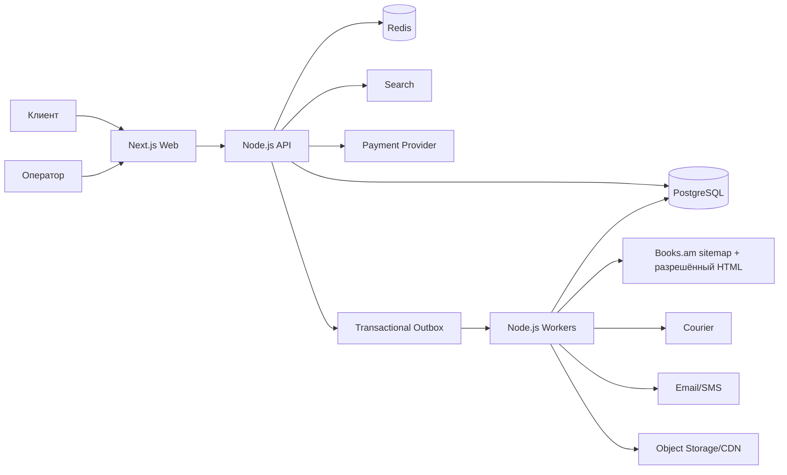

# Техническое задание: книжный интернет-магазин с закупкой через Books.am

**Версия:** 1.1  
**Дата исследования и реализации milestone:** 11–15 августа 2026 года  
**Статус:** целевое ТЗ и реализованный демонстрационный milestone; production launch gates остаются открыты  
**Рабочее название продукта:** LUMI Books  
**Основной рынок первой версии:** Ереван, Армения  
**Расчётная валюта:** AMD  

> Этот документ описывает продукт, архитектуру, бизнес-правила, интеграцию, безопасность, эксплуатацию, тестирование и критерии запуска. Он не заменяет юридическое или налоговое заключение.

---

## 0. Резюме и обязательные решения до production

Нужно создать отдельный интернет-магазин на Next.js и Node.js, который:

1. показывает каталог книг, полученный от Books.am;
2. продаёт каждую физическую единицу по правилу `актуальная закупочная цена + 500 AMD`;
3. добавляет `1000 AMD` за одну клиентскую доставку заказа;
4. принимает заявку, подтверждает заказ после проверки поставщика и получает наличные при доставке;
5. создаёт закупочный заказ у Books.am;
6. отслеживает закупку, доставку, отмену и возврат;
7. предоставляет клиентский кабинет и административную панель.

### 0.1. Главный launch gate

Промышленный парсинг и автоматическое оформление заказов нельзя запускать через обычный личный кабинет Books.am без письменного разрешения владельца сайта.

Причины:

- публичного документированного партнёрского API или feed на дату проверки не найдено;
- [robots.txt Books.am](https://www.books.am/robots.txt) закрывает от crawler пути `/catalog/`, `/checkout/`, `/customer/` и URL с query-параметрами;
- checkout использует сессию, CSRF/form key и внутренние Magento-механизмы, которые не являются публичным контрактом интеграции;
- Cloudflare, изменение HTML и антибот-защита сделают автоматизацию браузера нестабильной;
- тексты, изображения, логотипы и структура каталога могут охраняться авторским правом и правами на товарные знаки;
- передача имени, телефона и адреса клиента Books.am требует прозрачного правового основания и договорных условий;
- по [FAQ Books.am](https://www.books.am/faq) отображаемое наличие не гарантирует фактический остаток до подтверждения сотрудником.

### 0.2. Разрешённая целевая модель

Приоритет интеграций:

1. **Разрешённый sitemap/HTML-parser публичных товарных страниц** — основной и единственный источник каталога. Товарный API/feed для импорта каталога не используется.
2. **HTML-parser + ручное подтверждение закупки оператором** — MVP только при письменном B2B-разрешении и официальном канале закупки. Публичный флаг `in stock` подтверждением не является.
3. **HTML-parser + официальный order API**, если Books.am когда-либо его предоставит, — возможен только для закупки; каталог всё равно строится из HTML по требованию заказчика.
4. **HTML-parser + переход клиента на Books.am** — отдельная link-out бизнес-модель. В ней Books.am является продавцом, проект не принимает оплату за книгу, не добавляет собственные 500/1000 AMD и не выдаёт чек за неё. Нужны affiliate-договор, разрешение на каталог и ясное раскрытие продавца.

Parser обрабатывает только письменно разрешённые публичные SEO-страницы. Автоматизация личного кабинета, CAPTCHA, Cloudflare, скрытых Magento endpoints или HTML-checkout не входит в допустимый production scope.

### 0.3. Главный экономический вывод

Наценка `500 AMD` и доставка `1000 AMD` не гарантируют прибыль. Для COD возникают стоимость инкассации, риск отказа и замороженный оборотный капитал; при будущем онлайн-эквайринге комиссия будет начисляться на всю стоимость книги, а не только на наценку. Кроме того, возможны расходы на доставку Books.am, последнюю милю, упаковку, налоги, возвраты и поддержку. Поэтому до закупки система обязана рассчитывать прогнозную и стрессовую маржу и блокировать убыточные комбинации, не меняя скрытно обещанные клиенту `+500` и `1000`.

### 0.4. Что уже реализовано в репозитории

Текущий milestone — запускаемый full-stack прототип, а не заявление о готовности к production:

- стандартный Next.js App Router storefront и операторская admin UI на Tailwind CSS 4;
- локализованные публичные маршруты HY/RU/EN, каталог, карточка, корзина и COD checkout;
- NestJS/Fastify modular monolith с каталогом, pricing `+500 × N`, доставкой `1000`, заявками, ручной procurement queue, COD-контролями, admin API и Swagger;
- отдельный NestJS worker и permission-gated sitemap/HTML pipeline: exact sitemap/child policy, Cheerio parser, bounded discovery/refresh queue, conditional fetch, request budget, snapshots/quarantine и 403/429/challenge kill switch; development/test выполняют только mocked/fixture сценарии;
- Prisma schema целевой PostgreSQL-модели, Docker-конфигурация PostgreSQL/Redis, тесты и production builds.

До отдельного production этапа остаются: письменное разрешение Books.am, разрешённый B2B procurement path, активация crawler по согласованному бюджету, PostgreSQL repository adapters/migrations, durable crawler queue/snapshot archive/catalog publisher и outbox, клиентская и операторская identity/RBAC, реальная фискальная интеграция, курьерская интеграция, мониторинг и юридически утверждённые документы. Поэтому сохранённые fixtures и in-memory data нельзя принимать за уже выполненный реальный импорт Books.am или долговременное хранение.

---

## 1. Исходные требования и принятые допущения

### 1.1. Зафиксировано заказчиком

- Источник товарного ассортимента — Books.am.
- Каталог получается именно парсингом sitemap и HTML публичных страниц Books.am; товарный API/feed не используется.
- В клиентском магазине должны быть представлены все активные книги, которые доступны через разрешённые для обхода публичные HTML-страницы и которые Books.am разрешает передавать и продавать.
- Цена одной физической единицы для клиента равна текущей цене источника плюс 500 AMD.
- Доставка клиенту стоит 1000 AMD.
- География MVP — только Ереван; адрес вне разрешённой зоны не принимается.
- Единственный способ оплаты MVP — наличными курьеру при получении (`CASH_ON_DELIVERY`).
- После оформления клиентского заказа система должна инициировать соответствующую закупку у Books.am.
- Нужны витрина, корзина, checkout, клиентский кабинет, статусы заказа и административная часть.
- Технологический фундамент: Next.js и Node.js.

### 1.2. Допущения этого ТЗ

- `+500 AMD` начисляется на каждый экземпляр, а не на уникальное название.
- `1000 AMD` включается один раз в quote непустого заказа; удержание и возврат определяются результатом исполнения по §10.5.
- Клиентская цена и оплата в MVP ведутся только в AMD.
- Магазин по умолчанию проектируется как самостоятельный продавец и merchant of record, пока письменный агентский договор не установит иное.
- До подтверждения поставщика запись считается заявкой клиента (`PURCHASE_REQUESTED`), а не подтверждённой продажей. Магазин акцептует заявку после подтверждения/резерва и отправляет подтверждение на устойчивом носителе; хранятся `offer_submitted_at`, `contracted_at` и `terms_version`. Эту конструкцию до запуска утверждает армянский юрист.
- Прямая доставка Books.am клиенту выключена по умолчанию. Она включается только после договора, который разрешает dropshipping и передачу персональных данных.
- Если нет официального order API, закупку подтверждает оператор через административную очередь.
- Утверждение «все книги» означает все активные, разрешённые позиции, обнаруживаемые через допустимые sitemap/HTML URL. Полное покрытие нельзя технически гарантировать для закрытых robots.txt, удалённых, не связанных sitemap или защищённых страниц.

### 1.3. Требует решения владельца до пилота

- Юридическое лицо или ИП, выступающее продавцом.
- Точный allowlist районов/адресов Еревана, куда экономически допустима доставка за 1000 AMD.
- Максимальный вес, стоимость и количество книг в заказе.
- Разрешать ли частичное исполнение.
- Собственный склад/точка консолидации или прямой dropshipping.
- Курьер, порядок инкассации наличных и провайдер SMS/email.
- Политика возврата качественных книг после юридической проверки применимых исключений.
- Минимально допустимая маржа и риск-буфер.

---

## 2. Что установлено при исследовании Books.am

Проверка проводилась только по открытым страницам без отправки заказов, форм и без обхода защиты.

### 2.1. Каталог и интеграция

- Books.am работает на Magento.
- Публичного документированного API, публичного feed и опубликованной партнёрской программы не обнаружено.
- Страница [«О нас»](https://www.books.am/am/about) сообщает об оптовых продажах и поставках другим книжным магазинам. Поэтому нужны два независимых письменных разрешения: на sitemap/HTML crawling, хранение и публикацию полей/медиа; и отдельно — официальный ручной либо автоматизированный канал закупки у «Букинист».
- Внутренние Magento REST routes, form key и JSON-конфиги, видимые в HTML, не считаются разрешённым API.
- На дату проверки sitemap каждого языка разбит на семь сегментов. Армянский sitemap содержал около 98,5 тыс. URL-записей, но туда входят локализованные, служебные, категорийные, устаревшие и недоступные позиции. Это не число активных книг.
- В sitemap смешаны SEO-slug URL и закрытые robots.txt пути `/catalog/...`.

### 2.2. Данные карточки

Открытая карточка потенциально содержит:

- Magento entity id и SKU/код товара;
- название, автора/бренд;
- regular/final/special price и AMD;
- `is_salable`/индикатор наличия без количественного остатка;
- вес;
- barcode и ISBN;
- издателя, язык, серию;
- год, число страниц, переплёт, размер;
- HTML-описание;
- изображения;
- canonical URL и `lastmod`.

Обнаруженные особенности качества данных:

- ISBN/barcode бывают пустыми, нестандартными или не являются ISBN;
- один ISBN не гарантирует одну товарную позицию;
- вес может быть `0` или отсутствовать;
- значения смешивают армянский, русский и английский языки;
- один SKU имеет несколько locale URL и иногда дополнительные fallback URL;
- slug может измениться;
- out-of-stock карточки могут оставаться публичными и индексируемыми;
- Schema.org-разметка покрывает не все поля.

### 2.3. Цена, наличие, доставка

Согласно [FAQ Books.am](https://www.books.am/faq):

- книга может быть продана в филиале уже после отображения на сайте;
- статус «в обработке» ещё не подтверждает физическое наличие;
- по Еревану доставка бесплатна при заказе свыше 2000 AMD, иначе стоит 500 AMD;
- по регионам доставка выполняется через HayPost, обычно 5–7 рабочих дней, и зависит от веса.

Следствие: закупочную доставку нельзя всегда считать бесплатной. Перед закупкой нужна актуальная supplier quote, а клиенту нельзя обещать наличие до подтверждения/резерва.

### 2.4. Неопределённости

- Ссылка `/policy` на дату проверки возвращала 404.
- В открытой навигации и поиске не обнаружены отдельные публичные документы с полными правилами API, privacy, отмен и возвратов. Это не доказывает их отсутствия; документы нужно запросить непосредственно у Books.am.
- Не опубликованы SLA B2B-остатков, reservation TTL, обработка partial fill, правила dropshipping, возвратов и webhooks.

---

## 3. Цели, показатели успеха и границы проекта

### 3.1. Цели продукта

- Дать клиенту быстрый многоязычный поиск и заказ книг в одном магазине.
- Автоматизировать путь от актуальной supplier quote до закупки, доставки и возврата.
- Исключить продажу по устаревшей цене или без подтверждаемого наличия.
- Считать фактическую прибыль по каждому заказу.
- Обеспечить трассируемость денег, согласий, статусов и действий операторов.
- Масштабировать каталог без прямых запросов к Books.am во время клиентского просмотра.

### 3.2. KPI пилота

- Не менее 99% успешно загруженных разрешённых товарных HTML-страниц проходят парсинг или явно попадают в quarantine с причиной.
- Не менее 99,5% опубликованных preliminary offers имеют `observed_at` не старше согласованного crawl freshness SLA. Это измеряет возраст собственного HTML-наблюдения, а не гарантирует актуальность Books.am.
- 100% checkout-попыток проверяют возраст HTML snapshot и margin guardrail; authoritative price/stock подтверждаются только через разрешённый ручной/официальный procurement channel.
- 0 двойных списаний при повторных webhook/кликах.
- 100% закупочных запросов имеют idempotency key и внешний correlation id.
- 0 подтверждённых duplicate supplier orders; автоматический procurement включён только при external idempotency либо гарантированном поиске по merchant reference после ambiguous timeout.
- 100% денежных изменений отражены в immutable ledger.
- Доля отрицательной фактической маржи ниже согласованного порога; до согласования целевой порог — 0%.
- Не менее 95% заказов получают первый значимый статус в пределах операционного SLA.
- 100% неисполненной после capture суммы приводят к точному full/partial refund, PSP-confirmed/reconciled статусу и связанному фискальному документу в SLA.

### 3.3. Не входит в MVP

- Marketplace с несколькими независимыми продавцами.
- Продажа электронных книг и DRM.
- Собственная складская ERP полного цикла.
- Мобильные приложения iOS/Android; используется responsive web/PWA-ready UI.
- Международная доставка.
- Автоматический перевод защищённых описаний без прав на исходный контент.
- Обход ограничений Books.am, scraping закрытых путей или reverse engineering checkout.
- Сохранение PAN/CVV банковских карт.

---

## 4. Юридическая и договорная модель

### 4.1. Рекомендуемая модель MVP: самостоятельный продавец

Магазин продаёт товар клиенту от собственного имени, закупает его у Books.am и несёт перед клиентом ответственность за:

- правильную цену и описание;
- документ, подтверждающий продажу;
- оплату и возврат денег;
- доставку;
- качество, комплектность, отмены и обращения;
- privacy notice и обработку персональных данных.

Вся сумма клиента учитывается как продажа магазина, а платёж Books.am — как себестоимость, если бухгалтер/юрист не определит другую схему.

### 4.2. Альтернатива: раскрытый агент

Агентская модель допустима только при письменном договоре с Books.am, где определены:

- принципал и агент;
- кто является продавцом и merchant of record;
- кто выдаёт чек;
- что является комиссией;
- кто принимает деньги, отмены, возвраты и претензии;
- кто обрабатывает персональные данные;
- как раскрывается роль каждой стороны клиенту.

Слово «посредник» в интерфейсе или внутренних документах само по себе не создаёт агентскую модель.

`Merchant of record` используется только как технический термин платёжной схемы. Отдельно и явно фиксируются: продавец по потребительскому договору, получатель платежа по acquiring-договору и лицо, выдающее фискальный документ. В агентской модели это не обязательно одна сторона.

### 4.3. Обязательные юридические документы магазина

До production должны быть опубликованы и доступны до оплаты:

- реквизиты продавца, адрес и контакты;
- публичная оферта/условия продажи;
- privacy notice;
- cookie notice и управление необязательными cookies;
- условия доставки;
- правила отмены, обмена и возврата;
- способы и сроки возврата денег;
- правила оплаты и фискального документа;
- раскрытие получателей данных, их ролей, целей, правового основания и условий передачи Books.am/курьеру; отдельное consent запрашивается только когда оно действительно является применимым основанием;
- раскрытие роли Books.am без создания ложного впечатления об официальном партнёрстве.

Юридические действия разделяются:

- обязательный акцепт условий продажи и явно выбранной политики partial fulfillment;
- ознакомление с privacy notice — это информирование, а не универсальное «согласие на всё»;
- данные, необходимые для договора и доставки, обрабатываются на документированном применимом основании, а не только через одно отзывное consent;
- маркетинг, необязательная аналитика/cookies и геолокация имеют отдельные непредустановленные opt-in.

Версия документа, дата, locale, действие и timestamp сохраняются. IP-адрес сам является персональными данными и записывается как доказательство только при обоснованной необходимости, с ограниченным сроком хранения и маскированием доступа.

### 4.4. Правовые launch gates

Юрист и бухгалтер в Армении должны письменно подтвердить:

- модель продавца или агента;
- регистрацию деятельности, налоги, фискализацию/чек и бухгалтерский учёт;
- применимые права потребителя и исключения для книг;
- дистанционную продажу, отмены, обмен и возврат;
- законность передачи и трансграничного хранения персональных данных;
- role mapping для Books.am, PSP, курьера, хостинга и коммуникационных провайдеров; DPA/письменное поручение — когда контрагент обрабатывает данные от имени магазина, а для самостоятельного оператора — условия передачи, цели, основания, безопасность, сроки и распределение запросов субъектов;
- законность использования названий, описаний, обложек, фотографий, категорий и товарных знаков;
- допустимые customer-facing сравнения цен;
- условия рекламы, промокодов и уведомлений.

### 4.5. Договор с Books.am

До включения supplier integration получить письменные условия на:

- права получать и хранить каталог;
- права показывать описания и медиа, включая заверение Books.am о праве лицензировать/сублицензировать материалы издателей;
- способы использования, территория, срок, caching/CDN, перевод/адаптация, takedown и ответственность по правам на контент;
- частоту синхронизации и rate limit;
- B2B/розничную цену и НДС/налоговый статус;
- уникальные идентификаторы и локализации;
- остаток, резерв и срок его действия;
- создание, изменение и отмену закупочного заказа;
- dropshipping или адрес собственной точки;
- передачу клиентских данных;
- доставку, упаковку и split shipment;
- возврат, дефект и компенсацию;
- SLA, webhook, поддержку и ответственность;
- использование названия/логотипа Books.am;
- прекращение договора и удаление полученного контента.

### 4.6. Дистанционная продажа и права потребителя

По действующей на дату исследования редакции Закона РА «О защите прав потребителей» до заказа на армянском языке должны быть ясно раскрыты:

- полное фирменное наименование продавца, место деятельности, почтовый и электронный адрес, телефон;
- существенные характеристики конкретного издания;
- окончательная цена книги со всеми налогами и обязательными сборами, доставка 1000 AMD и итог;
- территория, способ и срок доставки;
- порядок претензий, отмены, возврата и внесудебного разрешения споров;
- момент, после которого действие клиента создаёт обязанность оплаты.

Кнопка завершения checkout должна недвусмысленно сообщать об обязанности оплаты. Подтверждение договора, состав, цена и версия условий отправляются клиенту на устойчивом носителе, например email/PDF, и остаются доступны в кабинете.

Для печатных книг обязательный 14-дневный отказ от дистанционно приобретённого товара надлежащего качества исключён действующей нормой для этой категории. Это не отменяет права клиента при повреждении, неправильном издании, недокомплекте или несоответствии описанию. Исключение нельзя автоматически применять к игрушкам, канцелярии и другим будущим категориям. Финальную формулировку политики должен утвердить армянский юрист.

Если иной срок не согласован, доставка должна быть выполнена не позднее 30 дней. При неисполнении и после предоставленного дополнительного срока клиент в предусмотренных законом случаях вправе расторгнуть договор, получить немедленный полный возврат и требовать убытки. Договор и UI должны показывать реалистичный диапазон и не обещать мгновенное наличие.

Риск случайного повреждения до фактического получения обычно несёт продавец; исключение для перевозчика, самостоятельно выбранного клиентом, применяется только после юридической проверки конкретного flow.

До запуска юрист должен подтвердить применимость обязательной гарантии не менее двух лет и в любом случае утвердить отображаемый срок требований по недостаткам, который по действующей редакции закона не должен быть менее двух лет, если из природы товара не следует подтверждённое законом исключение. Для дефекта/несоответствия сохраняются предусмотренные законом remedies: замена, уменьшение цены, расторжение и возврат денег либо иное применимое средство; коммерческая политика магазина не может их сузить.

### 4.7. Чек, налоги и платёжная квалификация

При модели самостоятельного продавца магазин выдаёт собственный электронный фискальный чек на всю сумму клиентской покупки. Чек Books.am подтверждает закупку магазина и не заменяет документ клиенту. Цена товара и доставка отражаются раздельно. Момент выдачи e-HDM и связь с `contracted_at`/capture утверждает бухгалтер; карточная authorization не является завершённой продажей.

PSP `void`/`refund` не заменяет фискальную операцию. При полном или частичном возврате система формирует связанный с исходным фискальным номером возвратный/корректирующий e-HDM-документ по утверждённой бухгалтером схеме.

В ТЗ нельзя считать, что налог начисляется только на 500 AMD. Налоговая база, режим НДС/оборотного налога, признание закупочной стоимости и доставки определяются выбранной моделью и письменным заключением бухгалтера/налогового юриста.

Платёж принимает лицензированный в Армении банк или платёжная организация через обычный acquiring flow. Если сервис начнёт принимать деньги «для Books.am», хранить клиентский баланс, делить выплаты или переводить средства поставщику от имени клиента, схема может стать регулируемой платёжной услугой. Такой flow не входит в MVP и не запускается без отдельного заключения специалиста по регулированию ЦБ РА.

### 4.8. Авторские права, база данных и бренд

Перепродажа законно приобретённого физического экземпляра сама по себе не даёт права копировать сайт, творческие описания, фотографии, обложки, структуру/существенную часть базы данных, логотип или автоматизировать закрытый доступ. Закон РА об авторском праве отдельно регулирует исчерпание права на распространение физического экземпляра и защиту баз данных, включая систематическое извлечение частей.

Поэтому права на каждую группу данных должны иметь `rights_basis` и срок действия. До получения лицензии допускаются только собственные/отдельно лицензированные материалы и минимальные фактические метаданные после юридического review. Неохраняемость отдельного факта не разрешает массовое или систематическое извлечение и повторное использование базы данных и не отменяет договорных ограничений. Интерфейс не копирует визуальный стиль Books.am и не заявляет «официальный партнёр» без договора.

### 4.9. Трансграничные данные и кибербезопасность

Для каждого получателя определяется роль: обработчик от имени магазина или самостоятельный оператор со своими целями. DPA нужен для порученной обработки; самостоятельная передача требует условий data sharing, правового основания, минимизации, безопасности, сроков и маршрута запросов субъекта.

Для зарубежного облака, CDN, email/SMS и observability необходимо отдельно проверить режим трансграничной передачи персональных данных. Одного DPA недостаточно: до передачи документируются допустимость страны/механизма и необходимое разрешение. Архитектура должна позволять выбрать допустимый регион хранения и отключить передачу PII неподтверждённому subprocessору.

До production юрист также проверяет применимость Закона РА «О кибербезопасности», действующего с 4 января 2026 года. Объём обязанностей зависит от статуса организации, сектора и возможной квалификации инфраструктуры; проект не должен самовольно считать себя освобождённым.

---

## 5. Термины и роли

### 5.1. Термины

- **Source/Supplier** — Books.am/«Букинист» как поставщик.
- **Source price** — подтверждённая цена одной единицы из разрешённого источника без клиентской наценки.
- **Offer** — локальное представление цены и доступности supplier SKU.
- **Quote** — неизменяемый снимок корзины, цены, доставки и срока действия.
- **Procurement order** — закупочный заказ магазина поставщику.
- **Purchase request** — заявка клиента до акцепта магазином и фиксации `contracted_at`.
- **Customer order** — принятая магазином заявка/договор продажи после юридически утверждённого события акцепта.
- **Reservation** — подтверждённое временное удержание supplier stock.
- **MoR** — техническая сторона платёжного acquiring flow; продавец по договору и лицо, выдающее чек, определяются отдельно.
- **PII** — персональные данные клиента.
- **Outbox** — надёжный журнал событий, записываемый в одной транзакции с бизнес-данными.

### 5.2. Роли

- `GUEST` — просмотр, поиск, корзина, гостевой checkout.
- `CUSTOMER` — личный кабинет, адреса, заказы, возвраты, privacy requests.
- `SUPPORT` — чтение timeline, коммуникация, ограниченные операции по регламенту.
- `PROCUREMENT_OPERATOR` — подтверждение supplier quote и закупки.
- `FULFILLMENT_OPERATOR` — приёмка, упаковка, передача курьеру.
- `FINANCE` — платежи, возвраты, сверка и unit economics.
- `CATALOG_MANAGER` — импорт, quarantine, нормализация, публикация.
- `ADMIN` — конфигурация без доступа к карточным данным.
- `SECURITY_AUDITOR` — read-only audit/security logs.

Используется RBAC с принципом минимальных прав. Критичные действия требуют step-up MFA, причины и audit trail.

---

## 6. Бизнес-правила цены и маржи

### 6.1. Базовая формула

Для позиции `i`:

- `q_i` — количество экземпляров;
- `S_i^q` — source price в момент quote;
- `N = Σq_i` — количество физических единиц;
- `P_q = Σ(q_i × S_i^q)` — supplier subtotal.

```text
ItemsTotal   = P_q + 500 × N
QuotedDeliveryFee = 1000, если N > 0; иначе 0
CustomerTotal = ItemsTotal + QuotedDeliveryFee
```

Все суммы хранятся как целые числа в AMD (`BIGINT`/integer minor units). Floating point для денег запрещён.

`QuotedDeliveryFee` включается в authorization заявки и в capture принятого заказа. Он окончательно удерживается после успешной доставки. При нулевом fill, полной отмене до отправки, потере или недоставке по вине магазина возвращаются 1000 AMD; клиентский отказ, неуспешная попытка и повторная доставка регулируются отдельной заранее раскрытой и юридически утверждённой матрицей.

### 6.2. Какую цену считать source price

Используется итоговая доступная цена официальной B2B quote для конкретного SKU и количества:

- учитывается официальная sale price, если она применима к этому заказу;
- не используются личные купоны, бонусы или закрытые скидки аккаунта сотрудника;
- B2B-скидка учитывается только согласно договору и бухгалтерской модели;
- supplier shipping не включается в цену единицы, а учитывается отдельной себестоимостью;
- при разных ценах по количеству каждая quote хранит точное правило и payload поставщика.

Публичный UI показывает собственную конечную цену магазина. Упоминание «цена Books.am +500» и логотип поставщика допускаются только с письменным разрешением; иначе это внутреннее правило ценообразования.

### 6.3. Quote

- Quote неизменяема после создания.
- 10 минут — только предварительный product default. Production TTL вычисляется как минимум из срока source quote/reservation, согласованного maximum TTL и безопасного окна PSP authorization; значение подтверждается capability matrix поставщика и PSP.
- `quote_expires_at = min(source_quote_expires_at, source_reservation_expires_at если есть, now + configuredMaxQuoteTTL)`.
- Quote содержит source SKU/id, ISBN/вариант, source URL, цену, количество, availability timestamp, доставку, налоги/fees, полную разбивку и версию pricing rule.
- Перед авторизацией и перед procurement выполняется повторная проверка.
- Просроченная quote не может быть оплачена; создаётся новая.
- Время authorization hold должно превышать P99 supplier confirmation плюс capture safety buffer; иначе этот PSP/flow не разрешается.

### 6.4. Изменение supplier price

- Цена выросла до оплаты: показать новую quote и запросить явное согласие.
- Цена выросла после authorization: изменить capture только с согласием; иначе поглотить разницу в разрешённом лимите или отменить заказ.
- Дополнительное списание после capture без нового подтверждения запрещено.
- Цена снизилась до закупки: уменьшить capture или сделать частичный refund, чтобы сохранить правило `source +500`.
- После подтверждённой закупки клиентская цена фиксируется.
- Нельзя заменять ISBN, издание, язык, обложку или состояние без согласия.

### 6.5. Реальная маржа

```text
CommercialSpread = 500 × N + 1000

PriceDrift = Σ q_i × (actualSourcePrice_i - quotedSourcePrice_i)

ContributionMargin =
  500 × N + 1000
  - PriceDrift
  - SourceDelivery
  - LastMile
  - Packaging
  - PaymentFees
  - Taxes
  - SupportCost
  - ExpectedLoss
  - OtherVariableCosts
```

Фактический эквайринг рассчитывается от всей списанной суммы, а условные fees применяются только при соответствующем событии:

```text
ActualPaymentFee =
  authorizationAndCaptureFees
  + percentage × CapturedAmount
  + I(refund) × RefundFee
  + I(chargeback) × ChargebackFee
```

В forecast индикаторы заменяются вероятностями. Комиссии refund/chargeback либо входят в `PaymentFees`, либо в `ExpectedLoss`, но не в оба показателя одновременно.

Пример, не являющийся тарифом: при source price 10 000 AMD, одной книге, последней миле 1000 AMD и комиссии 2,5% клиент платит 11 500 AMD, комиссия около 288 AMD, а до налогов, упаковки и поддержки остаётся около 212 AMD. При дорогих книгах модель быстро становится убыточной.

### 6.6. Margin guardrail

До показа финального checkout и повторно непосредственно перед capture система считает:

```text
CM_forecast = 500 × N + 1000 - estimatedCosts

CM_worst = 500 × N + 1000
  - maxPriceDrift
  - maxSourceDelivery
  - maxLastMile
  - paymentFee(maxAmount)
  - taxEstimate
  - riskBuffer
```

Комбинация разрешена, только если:

```text
CM_forecast >= configuredMinimumAbsoluteMargin
CM_forecast / CustomerTotal >= configuredMinimumMarginRate
CM_worst >= 0
```

Если правило не выполнено, допустимо:

- отключить товар, зону, количество или способ оплаты;
- отправить корзину на ручную проверку;
- предложить увеличить корзину;
- выбрать более дешёвую логистику/оплату;
- сообщить, что доставка по этому адресу недоступна.

Нельзя без согласования незаметно увеличить `+500` или `1000`.

Если после source reservation/confirmation изменились состав, цена, supplier shipping или порог бесплатной доставки и guardrail больше не проходит, capture запрещён. Система выполняет void, re-quote или компенсирующую отмену supplier reservation/order согласно протоколу провайдера.

### 6.7. Частичное исполнение

Checkout предлагает:

- `ALL_OR_NOTHING` — по умолчанию;
- `ALLOW_PARTIAL`;
- `WAIT_UNTIL_DATE` — только если supplier contract поддерживает backorder.

Если исполнена часть:

```text
FinalPayable =
  Σ acceptedFulfilledLineAmount
  + (fulfilledCount > 0 ? 1000 : 0)

RefundDue = CapturedAmount - FinalPayable
```

- `agreedCustomerUnitPrice` равна согласованной клиентом цене `source quote +500`, с автоматическим уменьшением при более низкой supplier price до закупки.
- Увеличить agreed price можно только через новую quote и явное согласие; поглощённый магазином price drift не перекладывается на клиента.
- За недоступную единицу возвращается списанная по immutable snapshot клиентская цена этой единицы, включающая согласованные source price и 500 AMD.
- Если не исполнено ничего, возвращается вся сумма, включая 1000 AMD.
- Если остальные книги доставляются, один сбор 1000 AMD сохраняется.
- Дополнительная split shipment по инициативе магазина не создаёт новый клиентский сбор без согласия.

Сумма refund отсутствующей позиции берётся из её фактически списанного customer snapshot, а не из изменившейся текущей карточки.

Если partial fill известен до capture, выполняется partial capture точной суммы, если PSP это поддерживает, либо void и новая authorization после согласия клиента. Если `FinalPayable > CapturedAmount`, требуется новая quote и отдельное подтверждение/платёж; автоматический добор запрещён. Cart-level скидки и округление распределяются по строкам детерминированным алгоритмом, сохранённым в quote snapshot.

`ALL_OR_NOTHING` атомарен с точки зрения клиента: provider не может финансово обязать магазин принять только часть без возможности отмены. При partial response до capture все supplier reservations/частичный order отменяются и authorization voided. Если поставщик уже создал неотменяемую частичную закупку, она уходит в ручную компенсацию/остаток магазина и не является основанием списать клиента вопреки выбранной политике.

`WAIT_UNTIL_DATE` не удерживает карточную authorization дольше лимита PSP. Ожидание идёт без capture; при появлении товара создаются новая quote и новая authorization.

### 6.8. Оборотный капитал

Магазин может заплатить Books.am раньше, чем PSP перечислит клиентские деньги, и отдельно должен финансировать возвраты/chargeback. Минимальный операционный резерв оценивается так:

```text
WorkingCapital >=
  DailySupplierSpend × PayoutLagDays
  + P95Refunds
  + ChargebackReserve
  + OperationalBuffer
```

Для COD вместо задержки payout учитывается полный цикл от закупки до получения наличных и вероятность отказа. Finance dashboard должен прогнозировать потребность минимум на 30 дней и блокировать новые закупки при нарушении утверждённого liquidity guardrail.

```text
RequiredLiquidity =
  outstandingSupplierObligations
  + refundLiabilities
  + chargebackReserve
  - availableSettledFunds
```

При превышении утверждённого лимита автоматический procurement останавливается, новые заявки не принимаются либо переходят в явно обозначенную ручную очередь без списания клиента.

---

## 7. Основные пользовательские сценарии

### 7.1. Поиск и покупка

1. Гость выбирает язык интерфейса: армянский, русский или английский.
2. Ищет книгу по названию, автору, ISBN, издателю или категории.
3. Открывает локальную карточку; запрос к Books.am в этот момент не выполняется.
4. Добавляет конкретный SKU/издание в корзину.
5. Checkout проверяет адрес, зону, лимиты и свежесть offer.
6. Backend получает/проверяет актуальную supplier quote.
7. Создаётся quote с TTL и margin decision.
8. Клиент акцептует условия продажи и выбранную partial policy, подтверждает цену и отправляет заявку с ясно обозначенной обязанностью оплаты при её принятии магазином.
9. Создаётся `PURCHASE_REQUESTED`; PSP ставит временную authorization hold. Экран и сообщение говорят: «Заявка получена; наличие ещё не подтверждено; сумма временно заблокирована». Номер заявки не выдаётся за чек или подтверждённую продажу.
10. Procurement service выполняет согласованный протокол резерва/подтверждения через официальный канал либо создаёт разрешённую B2B ручную задачу.
11. После точного fill и повторной margin-проверки магазин выполняет provider-specific saga из §11.2. `contracted_at` устанавливается только на утверждённом юристом событии акцепта, а не при создании заявки или authorization.
12. Клиент получает подтверждение договора на устойчивом носителе; e-HDM создаётся в утверждённый бухгалтером момент.
13. Закупка принимается/передаётся в разрешённый dropshipping, доставляется и закрывается.

### 7.2. Нет товара после заявки/оплаты

1. Система переводит позицию в `SOURCE_UNAVAILABLE`.
2. При `ALL_OR_NOTHING` отменяет все cancellable reservations/partial supplier order; authorization voided. Если деньги уже captured, выполняются полный refund и фискальная коррекция.
3. При `ALLOW_PARTIAL` до capture показывает новый состав и `FinalPayable`, получает согласие и делает partial capture либо новую authorization. После capture выполняет только требуемый partial refund.
4. Возврат создаётся идемпотентно и считается завершённым только после PSP-confirmed/reconciled статуса и фискального документа.
5. Offer скрывается или получает quarantine до следующего подтверждения наличия.

### 7.3. Изменилась цена

1. Quote получает `REQUOTE_REQUIRED`.
2. Новая цена и итог показываются клиенту.
3. Без явного согласия procurement не продолжается.
4. Старый authorization voided либо корректируется по возможностям PSP.

### 7.4. Возврат

1. Клиент выбирает заказ и причину.
2. Система различает добровольную коммерческую отмену, законный дистанционный отказ для применимой категории и дефект/несоответствие; политика магазина не может сузить обязательные remedies.
3. Создаётся RMA, при необходимости запрашиваются фото.
4. При дефекте магазин принимает товар, организует обязательную логистику и проводит проверку без неоправданной задержки; при споре экспертизу первоначально оплачивает магазин.
5. При расторжении деньги возвращаются в юридически установленный срок после получения товара либо допустимого доказательства его отправки. Проверка не может бессрочно задержать законный refund.
6. PSP refund и связанный фискальный корректирующий документ отслеживаются отдельно до reconciliation.
7. Возврат/компенсация от Books.am учитывается отдельно и не блокирует обязательство перед клиентом.

---

## 8. Функциональные требования: витрина

### 8.1. Локализация

- UI: `hy`, `ru`, `en`.
- Locale определяется URL-префиксом, а не только cookie.
- Каждая локаль имеет canonical/hreflang.
- Если перевода нет, применяется явно маркированный fallback; нельзя смешивать поля незаметно.
- Checkout и юридические согласия сохраняют locale.
- Армянские и русские запросы нормализуются с учётом Unicode, регистра, `ё/е`, дефисов и пробелов.

### 8.2. Каталог

- Главная: категории, новинки, популярное, подборки.
- Категорийные страницы с pagination/cursor.
- Фильтры: автор, издатель, язык книги, год, серия, переплёт, наличие, диапазон цены.
- Сортировка: релевантность, цена, новизна, популярность.
- Только опубликованные и прошедшие data-quality правила товары доступны в поиске.
- Out-of-stock товар может оставаться для SEO, но купить его нельзя.
- В листинге показываются цена магазина, состояние доступности и дата/характер подтверждения.

### 8.3. Поиск

- По названию, транслитерации, автору, ISBN/barcode, SKU, издателю и серии.
- Поддержка опечаток с ограничением, чтобы ISBN/SKU не исправлялись ошибочно.
- Автодополнение не раскрывает неопубликованные позиции.
- Нулевой результат предлагает изменить запрос/фильтр, но не подменяет издание.
- Search analytics хранится в агрегированном/минимизированном виде.

### 8.4. Карточка товара

Обязательные поля:

- название и конкретное издание;
- автор;
- язык;
- издатель, год, ISBN/barcode, SKU;
- страницы, переплёт, формат, вес — если валидны;
- лицензированные изображения и описание;
- конечная цена магазина;
- доступность: `предварительно доступно — наличие и цена подтверждаются до акцепта/списания`, `подтверждён резерв`, `нет в наличии`;
- срок актуальности цены;
- предполагаемый диапазон доставки, не безусловная дата;
- правила возврата, применимый срок требований по недостаткам/гарантии и ссылка на условия продажи.

Если вес `0`, ISBN невалиден или поле спорное, оно не показывается как достоверный факт до нормализации.

Надпись `В наличии` разрешена только при действующем подтверждённом резерве либо договорном realtime SLA, достаточном для такого обещания. Обычный публичный `is_salable` Books.am не даёт этого статуса.

### 8.5. Корзина

- Корзина работает для гостя и аккаунта.
- Объединение гостевой и пользовательской корзины разрешает конфликты количеством и повторной проверкой.
- Ограничения количества задаются supplier stock/антифродом.
- Строка фиксирует точный `productVariantId`/supplier SKU.
- Корзина не является quote и не обещает цену.
- Перед checkout показывается, какие позиции изменились или исчезли.

### 8.6. SEO

- Server-side metadata, canonical, hreflang, sitemap собственного сайта.
- Schema.org Product/Offer генерируется только из проверенных локальных данных.
- Noindex для поиска, корзины, checkout, кабинета, служебных фильтров и персональных страниц.
- Slug не является ключом; при смене создаётся 301 redirect.
- Удалённые товары возвращают 410 либо полезную out-of-stock страницу по SEO-политике.
- Никаких canonical на Books.am в режиме собственной продажи, если договор не требует иного.

---

## 9. Клиентский аккаунт и кабинет

### 9.1. Аутентификация

- Email и/или телефон с подтверждением.
- Пароли — Argon2id с актуальными параметрами; допустим passwordless OTP/magic link.
- Сессии в secure, HttpOnly, SameSite cookies.
- Rotation refresh/session tokens и отзыв всех сессий.
- Rate limit, credential-stuffing protection и CAPTCHA только как risk-based challenge.
- MFA рекомендуется для клиента и обязательна для привилегированных ролей.

### 9.2. Возможности кабинета

- Профиль и подтверждённые контакты.
- Адресная книга.
- Заказы и детальный timeline.
- Чеки/документы.
- Повтор заказа с новой quote, а не старой ценой.
- Отмена, RMA и статус refund.
- Настройки уведомлений.
- Экспорт персональных данных.
- Запрос исправления/удаления с учётом обязательного хранения бухгалтерских записей.
- Управление активными сессиями.

### 9.3. Адрес

Поля:

- страна, регион, город, индекс;
- улица, дом, корпус, квартира;
- подъезд, этаж, домофон;
- комментарий курьеру;
- имя получателя и подтверждённый телефон;
- необязательная геопозиция с отдельным согласием.

Адрес нормализуется, но исходное значение сохраняется. До оплаты проверяются зона, обязательные поля, весовые лимиты и явные ошибки.

---

## 10. Checkout, платёж и заказ

### 10.1. Checkout

Шаги:

1. Контакты/вход.
2. Адрес и доступная доставка.
3. Политика частичного исполнения.
4. Финальная quote и breakdown.
5. Способ оплаты: для MVP фиксированно «наличными при получении».
6. Раздельные юридические действия: обязательный акцепт условий/partial policy, ознакомление с privacy notice и отдельные необязательные opt-in.
7. Отправка заявки без онлайн-списания.
8. Экран заявки с её номером и без ложного статуса «договор/заказ подтверждён поставщиком»; оператор отдельно подтверждает наличие и договор.

### 10.2. Оплата MVP и будущая платёжная интеграция

В MVP включён только `CASH_ON_DELIVERY`: клиент ничего не платит при отправке заявки, а передаёт наличные курьеру при фактическом получении. Курьерское приложение/админка фиксирует сумму к получению, факт выдачи, сумму наличных, номер фискального документа и последующую инкассацию. Статус `DELIVERED` нельзя выставить до `CASH_RECONCILED`; оформленный отказ завершает отдельную ветку `CUSTOMER_REFUSED` и не считается доставкой. Изменение суммы курьером запрещено.

Онлайн-эквайринг не является launch gate COD-пилота и подключается отдельным post-MVP этапом. Когда он будет включён:

- PSP подключается через абстракцию `PaymentProvider`.
- Используются hosted fields/redirect/tokenization; PAN/CVV не проходят через backend.
- Поддерживаются `authorize`, `capture`, `void`, `refund`, `getStatus` и signed webhook.
- Idempotency key обязателен для каждой денежной команды.
- Webhook подпись проверяется по raw body и допустимому временному окну.
- Повторный webhook безопасен.
- Состояние заказа не определяется browser redirect клиента; авторитетен webhook/reconciliation.
- Refund по умолчанию выполняется тем же способом оплаты; иной способ допускается только с явного согласия клиента, при технической возможности и соблюдении закона о безналичных операциях.
- 3-D Secure применяется по правилам PSP и risk engine.
- COD остаётся отдельным payment flow и не симулируется через PSP authorization/capture.

До выбора PSP оформляется и тестируется capability matrix: `authorize`, срок hold, `capture`, partial capture, `void`, full/partial refund, status lookup, signed webhook, provider idempotency, reconciliation files и поведение ambiguous timeout. Автоматический flow запрещён, если hold не покрывает P99 supplier confirmation с safety buffer или отсутствует безопасная компенсация.

### 10.3. Денежный ledger

Ledger append-only хранит:

- authorization/capture/void/refund/chargeback;
- назначенную курьеру COD-сумму, `CASH_COLLECTED`, отказ, инкассацию и расхождение;
- supplier payment и refund;
- customer delivery charge;
- source shipping, last mile, упаковку;
- PSP fees;
- налоги/резервы;
- ручные adjustments с причиной и согласованием.

PSP `void`/`refund` связан с исходной транзакцией, а полный/частичный фискальный возврат — с исходным номером e-HDM. Денежный flow не считается закрытым, пока provider и fiscal statuses не reconciled.

Баланс не вычисляется только из текущего `order.status`. Все суммы сверяются с PSP, банком, поставщиком и курьером ежедневно.

Фактические cash-события ledger не смешиваются с forecast-резервами unit economics. Forecast хранится отдельной версией; при завершении заказа он сравнивается с фактом, а ожидаемые потери не дублируют уже записанные fees/refunds.

### 10.4. Машина состояний customer order

Payment, procurement и fulfillment имеют независимые state machines. Их нельзя сводить к одному жёсткому линейному статусу, потому что допустимый порядок reserve/capture/commit зависит от протокола A/B/C.

Заявка/договор:

```text
DRAFT
  -> QUOTED
  -> PURCHASE_REQUESTED
  -> CONTRACT_ACCEPTED
  -> FULFILLING
  -> DELIVERED
  -> COMPLETED
```

Payment aggregate:

```text
COD MVP:
NOT_STARTED -> CASH_DUE -> CASH_COLLECTED -> CASH_RECONCILED
CASH_DUE -> CUSTOMER_REFUSED | DELIVERY_FAILED

ONLINE post-MVP:
NOT_STARTED -> AUTHORIZED -> CAPTURE_PENDING -> CAPTURED
AUTHORIZED -> VOIDED
CAPTURED -> REFUND_PENDING -> PARTIALLY_REFUNDED | REFUNDED
branches: AUTH_FAILED, CAPTURE_FAILED, CAPTURE_IN_DOUBT, CHARGEBACK
```

Procurement aggregate:

```text
NOT_STARTED -> QUOTE_CHECKED -> PROCUREMENT_PENDING
PROCUREMENT_PENDING -> RESERVED -> COMMIT_PENDING -> CONFIRMED
PROCUREMENT_PENDING -> COMMIT_PENDING -> CONFIRMED
branches: SOURCE_UNAVAILABLE, PARTIAL_CONSENT_REQUIRED,
          COMMIT_IN_DOUBT, SOURCE_CANCEL_PENDING, CANCELLED, MANUAL_REVIEW
```

Fulfillment aggregate:

```text
NOT_READY -> INBOUND -> READY_FOR_DELIVERY
          -> OUT_FOR_DELIVERY -> DELIVERED
branches: DELIVERY_FAILED, LOST, RETURN_PENDING, RETURNED
```

Customer-facing derived status вычисляется из этих агрегатов и может иметь `REQUOTE_REQUIRED`, `AWAITING_SOURCE`, `AWAITING_CUSTOMER`, `CANCEL_PENDING` или `REFUND_PENDING`. Переходы выполняются только командами saga/domain service с optimistic lock/version. Прямое редактирование статуса из admin UI запрещено.

`offer_submitted_at`, `contracted_at`, payment capture и e-HDM timestamp — разные события. Одно не выводится автоматически из другого.

### 10.5. Отмена и возврат денег

| Сценарий | Денежное действие | 1000 AMD | Обратная логистика |
|---|---|---|---|
| COD: отмена до передачи курьеру | закрыть заявку/заказ, движения денег нет | не получены | магазин решает supplier return отдельно |
| COD: клиент отказался при вручении без дефекта | наличные не принимаются; применить заранее раскрытую законную политику | не получены; возможные требования только по утверждённой политике | по утверждённой матрице |
| COD: дефект выявлен после оплаты наличными | обязательный remedy; при возврате — документированный возврат денег и фискальная коррекция | по обязательной юридической матрице | обязательные расходы несёт магазин |
| До authorization | закрыть заявку без движения денег | не списывались | нет |
| Authorization без capture | `void`, не `refund` | void вместе с суммой | нет |
| Full cancel после capture, до отправки | полный PSP refund + фискальная коррекция | вернуть полностью | магазин решает supplier return отдельно |
| Нулевой fill/потеря/недоставка по вине магазина | полный refund + фискальная коррекция | вернуть полностью | магазин |
| Одна позиция отсутствует, остальные доставляются | partial refund её customer line snapshot | сохранить один сбор | магазин несёт свои supplier расходы |
| Дефект/неверное издание одной позиции | обязательный remedy по выбору/закону; при расторжении refund line snapshot и применимой части доставки | полный/частичный возврат определяется обязательной юридической матрицей | обязательные расходы несёт магазин |
| Дефект/несоответствие всего заказа | full statutory remedy/refund | вернуть, если договор расторгнут | магазин |
| Клиентский отказ/неуспешная попытка без дефекта | только по заранее раскрытой и законной политике | удержание/возврат по утверждённой матрице | по утверждённой матрице |
| Качественная печатная книга после доставки | общее 14-дневное право дистанционного отказа не применяется; возможна добровольная goodwill policy | по goodwill policy | по goodwill policy |

Дополнительные правила:

- При дефекте магазин обязан принять товар и провести проверку без неоправданной задержки; при споре экспертизу первоначально оплачивает магазин.
- При расторжении магазин забирает товар за свой счёт и возвращает деньги после получения товара либо допустимого доказательства отправки в установленный срок.
- Коммерческая политика не перекладывает обязательные расходы на клиента и не сужает законные replacement/price reduction/termination/refund remedies.
- Eligibility определяется по категории каждой позиции; книжное исключение нельзя автоматически распространять на канцтовары, игры или игрушки.
- Невозвращаемая комиссия PSP и отказ Books.am компенсировать закупку — риск магазина и не блокируют обязательство перед клиентом.
- Каждый full/partial refund имеет PSP status, фискальный возврат/коррекцию, сумму по строкам, delivery allocation, причину, deadline и reconciliation status.

---

## 11. Закупка у Books.am

### 11.1. Абстракция поставщика

Catalog worker не зависит от API Books.am: он получает sitemap и HTML. Ordering service не связывается с DOM/parser-кодом. Используются отдельные внутренние интерфейсы:

```ts
interface HtmlCatalogProvider {
  discoverFromSitemaps(cursor?: string): Promise<DiscoveredUrlBatch>;
  fetchProductHtml(url: string): Promise<HtmlSnapshot>;
  parseProduct(snapshot: HtmlSnapshot): Promise<ParsedSourceProduct>;
  refreshObservedOffer(url: string): Promise<ObservedOffer>;
}

interface ProcurementProvider {
  commitReservation?(reservationId: string, command: CommitSourceOrder): Promise<SourceOrder>;
  createOrder(command: CreateSourceOrder, idempotencyKey: string): Promise<SourceOrder>;
  cancelOrder(externalOrderId: string): Promise<SourceOrder>;
  getOrder(externalOrderId: string): Promise<SourceOrder>;
  findOrderByMerchantReference?(merchantReference: string): Promise<SourceOrder | null>;
}
```

Реализации:

- `BooksHtmlCatalogProvider` — основной источник каталога: sitemap + разрешённый публичный HTML.
- `ManualProcurementProvider` — MVP через письменно разрешённый B2B operator queue/channel.
- `BooksOrderApiProvider` — необязательный будущий адаптер только для закупки, если Books.am официально его предоставит.

`BooksHtmlCatalogProvider` не резервирует остаток и не превращает публичное `is_salable` в подтверждённое наличие. Parser и supplier ordering — разные подсистемы.

### 11.2. Процесс закупки

Общие шаги: получить свежую quote, сопоставить exact SKU/количество/издание, рассчитать source shipping, авторизовать платёж и непосредственно перед capture повторить price/stock/margin/liquidity проверки. Затем для конкретного официального provider выбирается ровно один документированный протокол:

**Протокол A — cancellable reservation, предпочтительный:**

```text
PAYMENT_AUTHORIZED
  -> SUPPLIER_RESERVED
  -> final margin + exact fill
  -> contract acceptance event
  -> PAYMENT_CAPTURED exact amount
  -> SUPPLIER_COMMIT_PENDING
  -> SOURCE_CONFIRMED
```

Если capture неуспешен, reservation отменяется. Если commit после успешного capture неуспешен, выполняются reconciliation и полный/частичный refund согласно fill.

**Протокол B — `createOrder` сразу финансово обязывает магазин:**

```text
PAYMENT_AUTHORIZED
  -> final pre-commit quote/fill/shipping/margin/liquidity check
  -> create supplier order
  -> validate actual supplier response and guardrails again
  -> contract acceptance + PAYMENT_CAPTURED
  -> SOURCE_CONFIRMED
```

Если post-create response даёт negative margin, изменённую цену, partial fill без согласия, re-quote либо capture failure, обязательны cancel/компенсация без списания клиента, `SOURCE_CANCEL_PENDING`, ручной alert и лимит открытой supplier exposure. Protocol B запрещён, если provider не даёт надёжной отмены/компенсации для каждого такого исхода.

**Протокол C — у поставщика нет резерва и order создаётся только после списания:** последняя синхронная проверка → contract acceptance/capture → supplier order → автоматический полный/частичный refund при supplier failure. Этот более рискованный flow включается только после письменного business/legal approval и финансирования refund reserve.

Семантика `quote`, `reserve`, `create`, `commit`, `cancel` и момент `contracted_at` фиксируются в provider contract/ADR и contract tests, а не определяются догадкой приложения.

Для каждого запроса используются `merchantReference`, local idempotency key и внешний idempotency key, если он поддерживается. При timeout после возможного commit состояние становится `PAYMENT_CAPTURE_IN_DOUBT` или supplier `COMMIT_IN_DOUBT`; повторная команда запрещена до `getStatus`/`findOrderByMerchantReference`/ручной reconciliation.

Автоматический procurement разрешён только если Books.am гарантирует external idempotency либо позволяет однозначно найти заказ по merchant reference после ambiguous timeout. Иначе создание supplier order остаётся ручным.

### 11.3. Ручной procurement fallback

До order API:

- система создаёт задачу оператору с exact SKU, URL, количеством и максимальной допустимой суммой;
- PII клиента не показывается, если закупка идёт на склад магазина;
- оператор подтверждает source price, shipping и наличие;
- второй сотрудник/правило подтверждает дорогие закупки;
- supplier order id и подтверждение прикладываются;
- capture выполняется только после подтверждения;
- просроченная задача автоматически отменяет authorization и уведомляет клиента.

Закупка выполняется только от имени зарегистрированного продавца/ИП, с его TIN, корпоративным способом оплаты и надлежащими закупочными документами. Личные аккаунты, карты и документы сотрудника не используются.

Credential корпоративного B2B supplier portal не хранится в БД приложения. Если договор разрешает portal access, секрет находится в secret manager, доступен ограниченной роли и ротируется.

### 11.4. Запрещённые способы

- headless browser/RPA для кликов по checkout как production API;
- обход CAPTCHA, Cloudflare, rate limits или CSRF;
- scraping `/customer/`, `/checkout/`, `/catalog/` вопреки правилам;
- использование cookies личного аккаунта в worker;
- угадывание или перебор product/order ids;
- повторная отправка заказа без idempotency/reconciliation;
- передача supplier account credentials клиентскому frontend.

---

## 12. Доставка и fulfillment

### 12.1. Модели

**Модель A — через точку магазина, по умолчанию:** Books.am доставляет/передаёт книги магазину, магазин проверяет, упаковывает и отправляет клиенту.

Преимущества: контроль качества, меньше PII у поставщика, единая упаковка. Недостатки: дополнительный этап и оборотный капитал.

**Модель B — dropshipping:** Books.am отправляет клиенту напрямую. Включается только если договор определяет брендирование, PII, роли сторон как обработчиков/самостоятельных операторов, основания и условия передачи, SLA, возвраты, split shipment и доказательство доставки.

### 12.2. Тариф 1000 AMD

- В quote включается один раз для непустой корзины; при принятии заказа входит в capture, а окончательно удерживается после успешной доставки.
- Доступен только в настроенных зонах, весе и габаритах, где guardrail не отрицателен.
- Для неподдерживаемого адреса checkout блокируется или создаёт ручной запрос, но не добавляет скрытую доплату.
- Источник-доставка Books.am — отдельная себестоимость и проверяется на quote.
- Если Books.am бесплатно доставляет только при пороге, частичное отсутствие может изменить себестоимость; margin пересчитывается.
- При нулевом fill, полной отмене до отправки, потере или недоставке по вине магазина 1000 AMD возвращаются. Отказ клиента, неуспешная попытка и повторная доставка следуют опубликованной матрице §10.5.
- После любого изменения состава и source shipping перед закупкой снова выполняется margin guardrail; при отрицательном результате — re-quote/cancel, а не скрытая доплата. Для будущего online-flow эта же проверка обязательна перед capture.

### 12.3. Shipment

- Один order может иметь несколько shipments, но один исходный delivery fee.
- Shipment хранит carrier, tracking, вес, габариты, стоимость, ETA и события.
- Клиент видит диапазон ETA, пока supplier не подтвердил позицию.
- Настраиваются попытки доставки, недозвон, хранение и return-to-sender.
- Proof of delivery минимизируется и хранится ограниченный срок.

### 12.4. Приёмка и качество

- Сверка SKU/ISBN, языка, переплёта, количества и состояния.
- Фото повреждения при исключении.
- Нельзя подменять издание «аналогичным».
- Несоответствие создаёт supplier claim и блокирует клиентскую отправку.

---

## 13. Каталог: модель данных и синхронизация

### 13.1. Источник истины

- Источник каталога — сохранённый и распарсенный HTML разрешённых публичных страниц Books.am, обнаруженных через sitemap. Товарный API/feed не используется.
- Цена и `is_salable`, извлечённые из HTML, имеют статус `PRELIMINARY_OBSERVED`, время наблюдения и URL; они не являются подтверждённым физическим остатком.
- Локальная БД — источник для витрины, поиска, корзины и исторических заказов.
- Books.am не запрашивается при каждом SSR/просмотре клиента.
- Quote/order хранит snapshot; изменение каталога не переписывает историю покупки.
- Финальным подтверждением закупки в MVP является разрешённое действие оператора и supplier order confirmation, а не результат HTML-parser.

### 13.2. Идентификация

Внутренний primary key — собственный immutable UUID. До письменного подтверждения Books.am рабочее сопоставление выполняется по:

```text
(supplier_id, supplier_sku, validity/version)
```

Стабильность и возможность повторного использования SKU должны быть зафиксированы в contract. Хранятся история mapping и validity interval. Дополнительно сохраняются Magento entity id, ISBN, barcode и canonical URL; ни одно из них, включая SKU до подтверждения, не является безусловным primary key.

### 13.3. Pipeline

```text
CRON / MANUAL SYNC
  -> CONDITIONAL GET SITEMAP INDEXES HY/RU/EN
  -> STREAM XML PARTS
  -> URL ALLOWLIST + ROBOTS/CONTRACT FILTER
  -> DEDUPLICATE CANONICAL/LOCALES
  -> ENQUEUE PRODUCT URLS
  -> RATE-LIMITED HTML FETCH
  -> CHECKSUM + ARCHIVE RAW HTML/HEADERS
  -> PARSE MAGENTO JSON + MICRODATA + DOM
  -> NORMALIZE
  -> VALIDATE
  -> STAGING TABLES
  -> DIFF
  -> UPSERT CANONICAL DATA
  -> PUBLISH/QUARANTINE
  -> SEARCH INDEX
  -> CACHE INVALIDATION
  -> METRICS + AUDIT
```

Каждый run имеет `sync_run_id`, sitemap cursor, `source_url`, `sitemap_lastmod`, `fetched_at`, `observed_at`, HTTP status, final URL, content hash, parser version, robots/contract decision, quarantine reason, количество create/update/noop/deactivate и ошибки.

Очереди разделяются на `sitemap_discovery`, `product_fetch`, `product_parse`, `media_ingest`, `catalog_publish` и `search_reindex`. Fetch и parse масштабируются отдельно; один ошибочный HTML не останавливает batch.

Приоритет извлечения полей:

1. встроенные Magento JSON-конфиги цены/товара;
2. Schema.org/microdata `Product`/`Offer`;
3. подписанные DOM-поля характеристик;
4. fallback selector только после contract fixture test.

Если два источника внутри страницы конфликтуют, товар получает `PARSER_CONFLICT` и не публикует новую цену автоматически.

### 13.4. Частота

Фактическая частота определяется письменным crawl budget. Предварительный режим:

- sitemap indexes: conditional GET каждые 6 часов;
- новые/изменённые по `lastmod` URL: в приоритетную очередь;
- популярные и добавленные в корзину товары: deduplicated refresh каждые 15–60 минут, только в пределах budget;
- long-tail HTML: равномерный sweep каждые 24–72 часа;
- полная URL reconciliation: еженедельно;
- медиа: только при изменении HTML/image URL/checksum;
- при входе товара в checkout: необязательная высокоприоритетная deduplicated crawl job, только если её разрешает budget. Checkout не делает прямой request-on-view и не считает результат authoritative quote; при невозможности обновить HTML решение принимает procurement operator.

Нельзя обновлять весь каталог каждые 5–15 минут посредством HTML. При 40 000 товарах и одном запросе в секунду один полный проход занимает около 11 часов без учёта retry.

Sitemap `lastmod` используется только как discovery/diff hint: не доказано, что он меняется при каждой смене цены или остатка. Sitemap/HTML никогда не являются авторитетной checkout quote.

### 13.5. Деактивация

- Отсутствие в одном batch не удаляет товар.
- После нескольких подтверждений/полной сверки позиция становится `SOURCE_MISSING`.
- История не удаляется каскадно в пределах утверждённого срока хранения.
- Публичная карточка переключается в out-of-stock/410 согласно SEO policy.
- Возврат позиции восстанавливает offer с новой версией.

После окончания retention либо прекращения лицензии PII и лицензированный контент удаляются/анонимизируются, кроме минимальных сведений, обязательных для налогового учёта, претензий и legal hold. Отдельные сроки действуют для raw supplier snapshots, изображений, описаний и PII в order snapshots.

### 13.6. Data quality

Проверки:

- цена — положительное целое AMD в разумном диапазоне;
- currency — AMD либо явная конвертация по согласованному B2B-правилу;
- SKU непустой и не конфликтует среди одновременно активных supplier mappings; reuse/history обрабатываются по договорному правилу;
- ISBN валидируется по ISBN-10/13, но не требуется и не уникален;
- barcode нормализуется отдельно;
- вес `0` трактуется как unknown;
- HTML санитизируется allowlist-политикой;
- locale и book language — разные поля;
- изображения проверяются по MIME, размеру, checksum и лицензии;
- дубликаты и конфликтующие поля отправляются в quarantine.

### 13.7. HTML-parser — основной способ каталога при письменном разрешении

- Сначала conditional GET sitemap index по ETag/Last-Modified.
- Все XML-сегменты читаются потоково, без загрузки многомегабайтного sitemap целиком в память.
- URL проходит exact-domain allowlist, HTTPS normalization, locale classification, canonical deduplication и diff по `lastmod`.
- Fetch выполняется только для письменно разрешённых SEO-slug URL; `/catalog/...` записи из sitemap отбрасываются.
- Не обращаться к закрытым `/catalog/`, query URLs, checkout/customer.
- Concurrency 1–2, согласованная задержка, backoff с jitter на 429/5xx.
- Явный User-Agent с названием сервиса и контактом.
- Kill switch и дневной budget запросов.
- Не обходить блокировку; при 403/429 остановить sync и уведомить оператора.
- При Cloudflare challenge parser останавливается; stealth, proxy rotation, CAPTCHA solving и browser fingerprint evasion запрещены.
- DOM selectors покрываются contract fixtures; изменение шаблона переводит данные в quarantine, а не публикует мусор.
- `lastmod` не доказывает свежесть цены/наличия.
- `lastmod` является только приоритетным hint, а не единственным условием повторного fetch; периодический полный rewalk разрешённых URL обязателен.
- HTML refresh создаёт только preliminary offer и никогда не меняет его в `CONFIRMED`. Собственный checkout может принять заявку и authorization, но capture выполняется только после ручного B2B supplier confirmation либо отдельного разрешённого order channel.
- URL, доступные только через запрещённый путь/защиту либо отсутствующие в разрешённых sitemap/SEO URL, находятся вне гарантируемого покрытия.
- Parser хранит `parser_version`, набор selector fixtures, HTTP status, content type, final URL, checksum и parse warnings для воспроизводимости.
- Рекомендуемая реализация: Node.js `undici` для HTTP, streaming XML parser для sitemap и `cheerio` для статического HTML; Playwright для массового crawl не используется.

### 13.8. Медиа и контент

- Описания/обложки загружаются только по лицензии Books.am с заверением о праве сублицензии издательских материалов либо по прямому разрешению правообладателя.
- Hotlink на Magento cache URL запрещён как нестабильный и потенциально неправомерный.
- Лицензированные файлы копируются в собственное object storage/CDN.
- Сохраняются source URL, license basis, checksum, dimensions, alt text и дата получения.
- Удаление лицензии запускает takedown workflow.
- Название/автор/ISBN как фактические данные отделяются от охраняемого описания и изображений.
- Неохраняемость отдельного факта не разрешает систематическое извлечение существенных или повторяющихся частей базы.

---

## 14. Административная панель

### 14.1. Dashboard

- Заказы по статусам и SLA.
- Procurement queue.
- Просроченные quote/authorization/refund.
- Ошибки sitemap/HTML fetch/parser и quarantine.
- Фактическая/прогнозная маржа.
- Доставка выше 1000 AMD.
- Алерты отрицательной маржи и stale catalog.

### 14.2. Каталог

- Поиск по SKU/ISBN/title/source id.
- Просмотр raw и normalized diff без unsafe HTML.
- Quarantine reason и reprocess.
- Ручное исправление только как overlay; source sync не стирает его без правила.
- Publish/unpublish с причиной.
- История цены, наличия, контента и media rights.

### 14.3. Заказы

- Полный timeline customer/payment/procurement/shipment/refund.
- Immutable quote и consent versions.
- Команды, доступные только из разрешённых состояний.
- Превью финансового эффекта до refund/partial fulfillment.
- Dual approval для дорогой закупки, большого refund и ручного adjustment.
- Маскирование PII по роли.

### 14.4. Конфигурация

С версионированием и audit:

- защищённая pricing policy с фиксированными для MVP `markup=500` и `delivery=1000`; менять её может только отдельный business approval flow с MFA/dual control, effective date и без влияния на существующие quote/orders;
- quote TTL/freshness;
- зоны и лимиты;
- PSP/courier cost models;
- source delivery thresholds;
- margin thresholds/risk buffer;
- partial-order policy;
- SLA и уведомления;
- feature flags;
- retention policy;
- fraud thresholds.

Изменение финансового правила вступает в силу с новой версией и не меняет существующие quote/orders.

### 14.5. Поддержка

Поддержка видит данные, необходимые для обращения, но не supplier password и не карточные реквизиты. Категории: платеж, дубликат, price change, out-of-stock, адрес, задержка, недоставка, повреждение, неправильная книга, отмена, возврат, chargeback.

---

## 15. Целевая архитектура

### 15.1. Технологии

- Monorepo: `pnpm` + Turborepo.
- Frontend: Next.js, App Router, React, TypeScript strict.
- Backend API: Node.js, NestJS с Fastify adapter, OpenAPI.
- Worker: отдельный Node.js процесс, BullMQ.
- БД: PostgreSQL, Prisma migrations/typed client; bulk-import через staging/COPY при необходимости.
- Очереди/cache/locks: Redis.
- Поиск: абстракция `SearchProvider`; Meilisearch для первой версии или OpenSearch при подтверждённом масштабе.
- Object storage: S3-compatible + CDN.
- Observability: OpenTelemetry, централизованные logs/metrics/traces и error tracking.
- Инфраструктура: Docker, IaC и managed services по выбранному облаку.

Точные версии фиксируются на старте реализации: текущая stable Next.js и Active LTS Node.js, затем pin в lockfile, Docker image и ADR. Автоматический переход на новую major-версию запрещён.

### 15.2. Структура monorepo

```text
apps/
  web/                 # витрина, checkout, кабинет, admin shell
  api/                 # REST API, auth, commerce, admin commands
  worker/              # sync, outbox, procurement, notifications, reconciliation
packages/
  db/                  # Prisma schema, migrations, repositories
  contracts/           # DTO, schemas, event contracts
  domain/              # money, pricing, order state machine
  ui/                  # дизайн-система
  config/              # typed config validation
  observability/       # logging, metrics, tracing
  testing/             # fixtures, mocks, provider simulators
infra/
  docker/
  terraform-or-equivalent/
docs/
  adr/
  runbooks/
```

### 15.3. Логическая схема



### 15.4. Модульные границы

- `Identity` — users, sessions, MFA, RBAC.
- `Catalog` — products, translations, taxonomy, media.
- `Crawler` — sitemap discovery, URL eligibility, HTML fetch, snapshots, parsing и quarantine.
- `Supplier` — observed offers и отдельный procurement confirmation/provider adapter.
- `Search` — indexing/query.
- `Cart` — ephemeral intent.
- `Pricing` — money, quote, margin.
- `Ordering` — customer order state machine.
- `Payments` — PSP, ledger, reconciliation.
- `Procurement` — supplier order and operator queue.
- `Fulfillment` — shipments, tracking, returns.
- `Notifications` — templates/preferences/outbox.
- `Compliance` — consents, privacy requests, retention.
- `Admin/Audit` — commands and immutable trail.

На старте это modular monolith с отдельными worker-процессами, а не набор микросервисов. Границы и события позволяют выделить сервисы позже без преждевременной операционной сложности.

### 15.5. Надёжность событий

- Бизнес-изменение и outbox event записываются в одной DB transaction.
- Worker публикует event at-least-once.
- Consumer идемпотентен по `event_id`/business key.
- Event schema версионируется.
- Dead-letter queue имеет alert, retry policy и безопасный replay.
- Нельзя использовать очередь как единственный источник денежного состояния.

---

## 16. Модель данных

### 16.1. Основные сущности

| Сущность | Назначение | Критичные поля |
|---|---|---|
| `users` | клиент/сотрудник | id, status, verified contacts |
| `sessions` | активные сессии | hashed token, device, expires_at |
| `addresses` | адресная книга | encrypted/minimized fields, zone_id |
| `products` | каноническая книга/товар | id, status, default variant |
| `product_variants` | конкретное издание/SKU | supplier_sku, ISBN, language, binding |
| `product_translations` | локализованный контент | locale, title, description |
| `authors`, `publishers`, `series` | справочники | normalized name, aliases |
| `categories` | taxonomy | parent_id, locale slugs |
| `media_assets` | лицензированные файлы | checksum, rights_basis, storage_key |
| `supplier_products` | связь с source | supplier id, external id, canonical URL |
| `supplier_offers` | текущая цена/наличие | price, currency, salable, observed_at |
| `crawl_urls` | discovery/очередь URL | locale, sitemap_lastmod, eligibility, priority, next_fetch_at |
| `robots_snapshots` | история ограничений | fetched_at, content hash, parsed rules, decision version |
| `html_snapshots` | raw HTML/history | storage ref, status, final URL, checksum, fetched_at, headers |
| `parser_results` | воспроизводимый parse | parser version, extracted fields, warnings, quarantine reason |
| `sync_runs`, `sync_errors` | crawl/ETL audit | sitemap cursor, stage counts, error reason |
| `carts`, `cart_items` | намерение покупки | variant, quantity |
| `quotes`, `quote_items` | immutable расчёт | expires_at, price snapshots, rule version |
| `orders`, `order_items` | request/order aggregate | offer_submitted_at, contracted_at, states, totals, snapshots |
| `order_state_events` | timeline | from/to, reason, actor, version |
| `procurement_orders/items` | закупка | source id, actual price, status |
| `payments` | платёжный aggregate | provider ref, authorized/captured/refunded |
| `payment_events` | provider/ledger events | type, amount, idempotency, raw ref |
| `refunds` | возвраты | reason, amount, state, provider ref |
| `fiscal_documents` | e-HDM продажа/коррекция | original ref, type, line allocation, status |
| `shipments/events` | доставка | carrier, tracking, cost, timestamps |
| `returns` | RMA | eligibility, inspection, recovery |
| `consent_records` | доказательства | document version, locale, timestamp |
| `privacy_requests` | права субъекта | type, status, due_at |
| `outbox_events` | надёжные события | event id/type/version/payload |
| `audit_logs` | действия сотрудников | actor, action, before/after ref, reason |
| `pricing_rules` | versioned rules | markup, delivery, effective interval |
| `cost_models` | экономика | PSP, courier, tax estimate, risk buffer |

### 16.2. Инварианты

- Один непротиворечивый active supplier mapping на `(supplier_id, supplier_sku, validity interval)`; внутренний variant имеет собственный UUID, а reuse SKU хранит новую версию mapping.
- `quote_items` не меняются; новая цена создаёт новую quote.
- Сумма order равна сумме item snapshots + delivery/adjustments по версии правила.
- `captured - refunded - chargeback` сверяется с ledger.
- Procurement item всегда связан с exact order item.
- PII и лицензированный source content не копируются в event/order snapshot без необходимости и собственного retention rule.
- Soft-delete не применяется как замена retention/anonymization policy.
- Timestamp хранится в UTC, показывается в Asia/Yerevan.
- Денежные поля содержат currency и integer amount.

### 16.3. Индексы и partitioning

- Unique: supplier/SKU, locale/slug, provider/idempotency key.
- B-tree: order customer/time/status, offer freshness, queue due time.
- Trigram/search index: normalized title/author/ISBN.
- Частичное индексирование active offers.
- Большие append-only `audit`, `events`, `snapshots` partition по времени после измерения объёма.
- Raw payload хранится в object storage, в БД — checksum, metadata и encrypted pointer.

---

## 17. API-контракты

### 17.1. Общие правила

- REST `/api/v1`, JSON UTF-8, OpenAPI.
- Входные данные валидируются runtime schema.
- Ошибка использует стабильный `code`, локализуемое client message и `correlationId`.
- Cursor pagination для больших коллекций.
- `Idempotency-Key` для checkout/order/payment/refund/procurement commands.
- `If-Match`/version для конкурентных admin commands.
- PII и secrets не попадают в URL/query/log.

### 17.2. Storefront API

```text
GET    /api/v1/catalog/products
GET    /api/v1/catalog/products/:slug
GET    /api/v1/catalog/categories
GET    /api/v1/search
POST   /api/v1/carts
GET    /api/v1/carts/:id
POST   /api/v1/carts/:id/items
PATCH  /api/v1/carts/:id/items/:itemId
DELETE /api/v1/carts/:id/items/:itemId
POST   /api/v1/quotes
GET    /api/v1/quotes/:id
POST   /api/v1/orders
GET    /api/v1/orders/:id
POST   /api/v1/orders/:id/cancel
POST   /api/v1/orders/:id/partial-consent
POST   /api/v1/orders/:id/returns
```

### 17.3. Identity/privacy API

```text
POST   /api/v1/auth/register
POST   /api/v1/auth/verify
POST   /api/v1/auth/login
POST   /api/v1/auth/logout
POST   /api/v1/auth/recovery
GET    /api/v1/me
PATCH  /api/v1/me
GET    /api/v1/me/sessions
DELETE /api/v1/me/sessions/:id
POST   /api/v1/me/privacy/export
POST   /api/v1/me/privacy/correct
POST   /api/v1/me/privacy/delete
```

### 17.4. Provider webhooks

```text
POST /api/v1/webhooks/payments/:provider
POST /api/v1/webhooks/supplier/:provider
POST /api/v1/webhooks/carriers/:provider
```

Webhook endpoint:

- читает raw body;
- проверяет подпись, timestamp и replay;
- сохраняет receipt до обработки;
- отвечает быстро;
- обрабатывает асинхронно и идемпотентно;
- не доверяет client-supplied status.

### 17.5. Admin API

```text
GET  /api/v1/admin/orders
POST /api/v1/admin/orders/:id/commands/:command
GET  /api/v1/admin/procurement/tasks
POST /api/v1/admin/procurement/tasks/:id/confirm
POST /api/v1/admin/procurement/tasks/:id/reject
GET  /api/v1/admin/catalog/quarantine
POST /api/v1/admin/catalog/:id/reprocess
POST /api/v1/admin/catalog/:id/publish
POST /api/v1/admin/sync-runs
GET  /api/v1/admin/reconciliation
POST /api/v1/admin/refunds/:id/approve
GET  /api/v1/admin/audit
```

### 17.6. Доменные события

```text
catalog.product.changed.v1
catalog.sitemap_discovered.v1
catalog.html_snapshot_fetched.v1
catalog.parse_quarantined.v1
supplier.offer.changed.v1
quote.created.v1
quote.expired.v1
purchase.requested.v1
contract.accepted.v1
payment.authorized.v1
payment.capture_failed.v1
order.created.v1
order.state_changed.v1
procurement.requested.v1
procurement.confirmed.v1
procurement.failed.v1
shipment.state_changed.v1
refund.requested.v1
refund.completed.v1
fiscal.document_issued.v1
privacy.requested.v1
```

---

## 18. Фоновые задачи и расписание

| Job | Trigger | Idempotency | Failure policy |
|---|---|---|---|
| sitemap discovery | conditional schedule | sitemap URL + ETag/hash | backoff, stop on robots/contract change |
| product HTML fetch | crawl queue | URL + expected snapshot version | global rate limit, 403/429 kill switch, DLQ |
| HTML parse/normalize | new snapshot | content hash + parser version | quarantine, no stale overwrite |
| allowed URL full rewalk | crawl-budget schedule | URL + rewalk window | single scheduler lock, resumable cursor |
| offer freshness sweep | schedule | observed offer version | mark stale, never invent price |
| quote expiry | delayed job | quote id/version | expire once |
| procurement submit/poll | event/schedule | order id + attempt key | stop on ambiguous result, reconcile |
| payment webhook process | webhook receipt | provider event id | replay-safe |
| payment reconciliation | daily/hourly | provider settlement id | finance alert |
| shipment tracking | webhook/poll | carrier event id | SLA alert |
| refund reconciliation | schedule | refund/provider id | escalate overdue |
| fiscal issue/correction reconciliation | payment/refund event + schedule | original fiscal ref + operation id | finance alert, no silent retry duplicate |
| search indexing | catalog event | product version | rebuild alias/index safely |
| notifications | domain event | template + event + recipient | preference/consent check |
| retention/anonymization | approved schedule | policy version + subject id | legal hold check |

Для неоднозначной supplier timeout нельзя автоматически создать второй заказ. Сначала выполняется `getOrder`/reconciliation по idempotency key.

---

## 19. Безопасность и приватность

### 19.1. Базовый стандарт

- OWASP ASVS Level 2 как acceptance baseline.
- Threat model до checkout implementation и перед production.
- TLS, HSTS, CSP, secure headers, CSRF protection, output encoding.
- Параметризованные запросы и ORM; raw SQL только reviewed.
- SSRF allowlist для supplier/media fetchers; запрет private/link-local networks.
- Санитизация source HTML; raw HTML не рендерится.
- File MIME sniffing, size limits, image re-encoding/scan.
- WAF/rate limit/bot protection на публичных endpoints.
- Dependency/container/IaC/secret scanning в CI.
- Регулярный pentest checkout/admin до запуска.

### 19.2. Секреты

- Только secret manager; не `.env` в репозитории и не БД.
- Отдельные ключи dev/staging/prod.
- Rotation и access audit.
- Supplier/PSP credentials доступны только нужному runtime identity.
- Логи маскируют authorization headers, cookies, tokens и PII.

### 19.3. Персональные данные

- Для каждого поля документируются purpose, legal basis, recipients и retention.
- Для каждого recipient фиксируются роль, собственные цели, DPA либо data-sharing terms и механизм трансграничной передачи; Books.am, PSP и курьер не считаются автоматически processors.
- Data minimization: supplier не получает данные, если заказ идёт через склад магазина.
- Direct dropship раскрывает Books.am как recipient до оплаты.
- Шифрование at rest для чувствительных полей и backups.
- Field-level encryption для данных, которые не нужны поиску.
- Role-based masking в admin.
- Production PII не копируется в dev/test.
- Export/correction/deletion workflow с legal hold и бухгалтерскими исключениями.
- Backup retention ограничен; после restore применяются deletion/anonymization tombstones. Сервис не обещает мгновенное физическое удаление из immutable backup, но исключает возврат удалённых данных в рабочую систему после восстановления.
- Инцидентный runbook включает оценку и уведомления согласно применимому закону.

### 19.4. Антифрод

- Решения `ALLOW`, `CHALLENGE`, `MANUAL_REVIEW`, `DENY`.
- Лимиты суммы, количества, попыток, аккаунтов, телефона, устройства/IP и адреса.
- OTP для рискованных/первых заказов по политике.
- Высокая сумма, разные плательщик/получатель, повторные отказы или отмены после закупки повышают risk score, но не доказывают мошенничество.
- Возврат по умолчанию тем же способом; исключение требует явного согласия, технической возможности и соблюдения закона о безналичных операциях.
- Evidence для chargeback хранится минимально необходимый срок.

### 19.5. Admin security

- SSO/MFA желательно, MFA обязательно.
- Отдельный admin hostname/access policy.
- Re-authentication для refund, role change, secret/config operations.
- Dual control для критичных сумм.
- Нельзя удалить или изменить audit event из UI.

---

## 20. Нефункциональные требования

### 20.1. Производительность

Начальные SLO, уточняемые после load model:

- Storefront LCP p75 ≤ 2,5 с на целевых мобильных устройствах.
- CLS p75 ≤ 0,1.
- Catalog/search API p95 ≤ 500 мс при cache hit/нормальной нагрузке.
- Checkout API p95 ≤ 2 с без времени внешнего PSP/supplier.
- Admin list p95 ≤ 1 с для типовых фильтров.
- Изображения responsive, modern formats, lazy load вне первого экрана.

### 20.2. Доступность

- Storefront/API monthly SLO: 99,9%.
- Checkout/order path: 99,9%, исключая подтверждённый downtime providers.
- Supplier outage не должен ломать просмотр локального каталога; checkout переключается в честный unavailable/manual state.
- Maintenance migrations должны быть backward compatible.

### 20.3. Масштаб

Проектировать минимум на:

- 100 тыс. locale URL/variants и 50 тыс. canonical products в первой волне;
- рост до 500 тыс. variants без смены доменной модели;
- 100 read requests/sec устойчиво и кратковременный burst 300 RPS;
- 20 checkout/order attempts/min в пилоте с горизонтальным ростом;
- миллионы price/audit events с partition/archival.

Это инженерные стартовые допущения, а не прогноз бизнеса; перед production проводится load test по реальному трафику.

### 20.4. Резервное копирование и DR

- PostgreSQL PITR, зашифрованные backups, регулярный restore test.
- Целевой RPO ≤ 15 минут, RTO ≤ 2 часа для order/payment data.
- Object storage versioning для критичных артефактов.
- Redis/search восстанавливаются из БД/events и не являются единственным источником истины.
- Документированный failover и contact tree.

### 20.5. Доступность интерфейса

- WCAG 2.2 AA для ключевых flows.
- Полная клавиатурная навигация, видимый focus, labels/errors.
- Не полагаться только на цвет.
- Локализованные screen-reader тексты и корректный `lang`.

---

## 21. Observability и эксплуатация

### 21.1. Трассировка

Единый `correlation_id` связывает:

- web request;
- quote/order;
- payment provider refs;
- procurement/source order;
- shipment;
- outbox/worker events.

PII и raw provider secrets в traces/logs запрещены.

### 21.2. Метрики

Каталог:

- sitemap/crawl lag, fetch/parse duration, throughput, HTTP status и quarantine rate;
- coverage funnel `discovered/eligible/fetched/parsed/published` по locale;
- active/stale/missing offers;
- price-change distribution;
- search zero-result rate.

Коммерция:

- conversion, quote expiry/requote;
- authorization/capture/refund success;
- supplier confirmation/fill rate;
- partial/unavailable/cancel rate;
- delivery first-attempt success;
- actual/forecast margin, negative-margin rate;
- PSP fee as share of 500 AMD markup;
- source delivery paid rate;
- last-mile cost above 1000 AMD;
- support contact rate и SLA.

### 21.3. Алерты

- sitemap crawl/HTML snapshots просрочены;
- массовый скачок цены или out-of-stock;
- parser schema drift;
- отрицательная stress margin;
- payment captured без procurement confirmation;
- supplier confirmed без expected customer payment state;
- refund просрочен;
- webhook signature failures/replay spike;
- очередь/DLQ растёт;
- reconciliation mismatch;
- courier SLA нарушен;
- backup/restore test failed.

### 21.4. Runbooks

Нужны инструкции:

- supplier outage/429/contract suspension;
- payment provider outage и ambiguous capture;
- duplicate source order;
- stale/incorrect mass pricing;
- leaked credential;
- PII incident;
- failed migration/rollback;
- lost shipment;
- refund delay;
- search index corruption;
- emergency catalog/checkout kill switch.

### 21.5. Проверяемая SLA-матрица

До go-live все символические сроки получают числовые значения из supplier/PSP/courier contracts и юридической политики. Пустое значение блокирует соответствующий flow. Для каждого объекта сохраняются `owner`, `policy_version`, `started_at`, `due_at`, `breached_at` и breach action.

| Этап | Владелец | Deadline rule | Действие при нарушении |
|---|---|---|---|
| Quote | Pricing | минимум provider expiry и configured max | запрет оплаты, новая quote |
| Authorization | Payments | hold > P99 supplier confirm + capture buffer | не начинать flow/void до expiry |
| Supplier confirmation | Procurement | `T_supplier_confirm` из B2B SLA | escalation, void или approved compensation |
| Ручная закупка | Procurement operator | раньше `T_manual` и auth safety deadline | alert, остановка, void |
| Re-quote/partial consent | Customer/System | `T_consent`, не позже quote/reservation expiry | cancel reservation, void; без автодобора |
| `WAIT_UNTIL_DATE` | Customer/System | выбранная клиентом дата | authorization не удерживать; создать новую quote/auth при наличии |
| Отправка | Fulfillment | обещанный диапазон/`T_dispatch` | уведомление, escalation, право отмены по политике/закону |
| Доставка | Carrier/Store | согласованный срок, при отсутствии иного не позже применимого 30-дневного предела | дополнительный срок, затем полный refund/убытки в применимом случае |
| RMA acknowledgement | Support | внутренний target не более 1 рабочего дня либо более короткий законный срок | supervisor alert |
| Проверка дефекта | Returns | утверждённый законом максимальный `T_inspection` без неоправданной задержки | auto-escalation; права клиента не приостанавливаются бессрочно |
| Refund initiation | Finance | утверждённый законом `T_refund_initiate`; внутренний target — следующий рабочий день | critical alert/escalation |
| Зачисление refund | PSP | отдельно показанный provider ETA | reconciliation и обращение в PSP; не выдавать initiation за receipt |

Для платёжного инцидента стартовый внутренний target первой реакции — 30 минут в рабочее время, для оплаченного/заблокированного, но неподтверждённого заказа — 2 часа, для обычного обращения — один рабочий день. Эти targets не отменяют более короткие законные сроки.

---

## 22. Уведомления

Транзакционные события:

- заказ получен;
- платёж авторизован/неуспешен;
- ожидается подтверждение поставщика;
- нужен re-quote/partial consent;
- закупка подтверждена;
- передано в доставку;
- доставлено;
- отмена/refund инициирован и завершён;
- задержка.

Правила:

- email/SMS templates версионируются и локализуются;
- маркетинг отделён от транзакционных уведомлений и требует отдельного consent;
- сообщение не содержит лишнюю PII;
- retry не создаёт дубли; используется notification idempotency key;
- ссылка в письме не раскрывает заказ без авторизации/одноразового токена.

---

## 23. Ошибки и крайние случаи

Система должна явно покрывать:

- товар продан через 5 минут после sync;
- source price изменился между quote, authorization и procurement;
- supplier подтвердил только часть количества;
- supplier API timeout после фактического создания заказа;
- binding supplier response с новой ценой/partial fill и отрицательной маржой до capture;
- payment capture timeout с неизвестным результатом;
- повторный webhook и webhook вне порядка;
- клиент дважды отправил заявку; в будущем online-flow — дважды нажал оплату;
- redirect PSP потерян, но платёж успешен;
- authorization истёк до supplier confirmation;
- capture успешен, ответ потерян;
- customer refund успешен, локальный worker упал;
- Books.am позже отменил подтверждённую позицию;
- duplicate SKU или ISBN у разных изданий;
- SKU сменился/объединился;
- slug/locale URL изменился;
- вес равен 0, доставка не рассчитывается;
- source shipping стал платным после partial fill;
- изображение недоступно/права отозваны;
- HTML description содержит script/event handler;
- 429/403/Cloudflare block;
- адрес вне зоны или цена последней мили >1000;
- split shipment;
- клиент меняет адрес после передачи курьеру;
- отказ от получения/COD fraud;
- возврат только одной единицы из количества;
- chargeback после refund;
- удаление аккаунта при незавершённом заказе/legal hold;
- смена pricing rule во время checkout;
- часовой пояс/переход даты и срок quote;
- массовая ошибочная цена из-за DOM/template drift;
- компрометация supplier/PSP secret.

Для каждого случая нужны automated test, ожидаемое состояние, компенсационная команда и инструкция оператору.

---

## 24. Тестирование

### 24.1. Уровни

- Unit: money/pricing/margin/state machines/normalizers.
- Property-based: суммы, количества, partial refunds, идемпотентность.
- Contract: сохранённые sitemap/HTML fixtures Books.am, selector/template drift, redirects, 404/403/429 и optional procurement/PSP/courier schemas.
- Integration: PostgreSQL, Redis, queues, outbox, search.
- E2E: три locale, guest/account checkout, auth/capture/refund.
- Visual/accessibility: ключевые страницы и WCAG automation + manual audit.
- Load: catalog/search/checkout/jobs/reindex.
- Security: SAST/DAST/dependencies/secrets/IaC/pentest.
- Failure/chaos: provider timeout, duplicate/out-of-order events, worker restart.
- Restore: регулярное восстановление DB/object data.

### 24.2. Обязательные финансовые тесты

- одна и несколько книг;
- несколько экземпляров одной книги;
- source sale price;
- price increase/decrease;
- delivery fee один раз;
- пустая корзина;
- partial fulfillment/refund;
- full cancellation возвращает 1000;
- потеря/недоставка возвращает 1000, успешная partial delivery удерживает один сбор;
- percentage + fixed PSP fee;
- supplier shipping threshold;
- high-price negative margin;
- integer overflow/никакого floating point;
- повторный refund/idempotency;
- ledger, PSP и e-HDM reconciliation.

### 24.3. Supplier simulator

В репозитории должен быть fake provider, который воспроизводит:

- success;
- out-of-stock;
- price drift;
- partial fill;
- timeout before/after commit;
- 429/5xx;
- duplicate/delayed/out-of-order webhook;
- malformed sitemap/HTML;
- DOM/template/schema drift;
- reservation expiry.

Production тесты не должны создавать реальные заказы без отдельного sandbox/письменного разрешения.

---

## 25. Критерии приёмки

### 25.1. Каталог

- Для 100% успешно полученных HTML-страниц существует terminal outcome: `PUBLISHED`, `NO_CHANGE` или `QUARANTINED` с причиной.
- Coverage измеряется отдельно по стадиям `discovered → contract/robots eligible → fetched → parsed → published/quarantined` для каждой locale.
- Знаменатель покрытия — только разрешённые sitemap/SEO URL. Закрытые, защищённые и отсутствующие в sitemap страницы явно `OUT_OF_SCOPE`; ТЗ не обещает 100% всего Books.am.
- Дубли по locale объединяются в одну variant-сущность.
- Некорректная запись не ломает batch и попадает в quarantine с причиной.
- `observed_at` цены/`is_salable` обновляется в пределах crawl SLA; это не гарантия фактической актуальности Books.am.
- Исчезновение из одного crawl/sitemap snapshot не удаляет историю.
- Витрина не запрашивает Books.am на каждый page view.

### 25.2. Цена

- Для `N` экземпляров item markup строго `500 × N`.
- Quoted delivery строго 1000 один раз; удержание/возврат соответствует матрице §10.5.
- Quote immutable и истекает по TTL.
- Checkout не проходит со stale/negative-margin offer.
- Изменение цены требует описанного re-quote.
- Суммы совпадают между UI, API, PSP command, order и ledger.

### 25.3. Заказ и закупка

- Двойной click/retry создаёт одну заявку/один локальный customer order. Один supplier order гарантируется только при external idempotency либо однозначном lookup по merchant reference; иначе тест подтверждает переход в manual reconciliation без повторной отправки.
- Exact SKU/edition сохраняется end-to-end.
- Capture и supplier commit следуют единственному выбранному протоколу A/B/C; без свежей quote/reservation/финальной проверки, contract acceptance event и пройденных margin/liquidity guardrails capture запрещён.
- При ручном fallback оператор видит все данные для безопасной закупки и deadline.
- Ambiguous timeout не вызывает повторную закупку до reconciliation.

### 25.4. Платёж и refund

- Browser redirect не может сам установить paid status.
- Неверная webhook signature отвергается.
- Повторный webhook не меняет сумму повторно.
- Full/partial refund правильно отражается в PSP, ledger и связанном e-HDM correction document.
- Daily reconciliation выявляет заданные тестовые расхождения.

### 25.5. Privacy/security

- PII не появляется в logs/traces.
- Непривилегированная роль не видит скрытые данные/команды.
- Customer export/correction/deletion request проходит workflow.
- Direct dropship не включается без role mapping, правового основания, применимого DPA/data-sharing/transfer configuration и требуемого customer disclosure.
- Security tests и независимый pentest не имеют открытых critical/high findings к запуску.

### 25.6. Эксплуатация

- Backup восстановлен на тестовом окружении в пределах RTO/RPO.
- Kill switch останавливает checkout/procurement отдельно от витрины.
- Runbooks проверены tabletop exercise.
- Dashboards и алерты срабатывают на тестовые инциденты.

---

## 26. Среды, CI/CD и release process

### 26.1. Среды

- `local` — fake providers.
- `dev` — shared integration, synthetic data.
- `staging` — production-like, PSP sandbox и supplier sandbox, если он существует; иначе только письменно согласованный безопасный тестовый протокол без несанкционированной реальной продажи.
- `production` — отдельные аккаунты, сети, секреты и данные.

### 26.2. Pipeline

На каждый PR:

- format/lint/typecheck;
- unit/property/contract tests;
- build Next.js/API/worker;
- migration validation;
- dependency/license/secret/SAST scan;
- preview без production PII.

Перед production:

- integration/E2E/load/security tests;
- backward-compatible DB migration;
- canary/blue-green deployment;
- health/readiness checks;
- rollback application и forward-fix DB plan;
- smoke test без реальной покупки либо через официальную sandbox.

Feature flags отдельно управляют catalog publishing, checkout, payment capture, automatic procurement, dropshipping и notifications.

---

## 27. Этапы реализации

Сроки начинаются после получения ответов поставщика и выбора провайдеров. Это диапазоны для команды 5–7 человек, а не фиксированное обещание.

### Этап 0. Договоры и discovery — 2–4 недели

- B2B-запрос Books.am.
- Юридическая/налоговая модель.
- Реальные тарифы PSP, курьера и supplier shipping.
- Репрезентативные sitemap/HTML fixtures и письменный crawl/data-use contract: URL patterns, rate, concurrency, User-Agent, caching, retention и media rights.
- Threat model, UX flows, ADR.

**Exit:** подписанные/письменно согласованные права и технический integration path.

### Этап 1. Платформа и каталог — 4–6 недель

- Monorepo, environments, CI/CD, observability.
- DB, raw/staging/normalized import.
- Многоязычный каталог, поиск, карточка, admin quarantine.
- Fake provider и contract tests.

**Exit:** разрешённые sitemap/HTML страницы стабильно проходят discovery, fetch, parse, quarantine/publish и coverage-метрики.

### Этап 2. Commerce — 5–7 недель

- Identity, кабинет, cart/quote/pricing.
- Address/zones/margin guardrail.
- Checkout, PSP sandbox, ledger.
- Consents и документы.

**Exit:** E2E order в sandbox без supplier purchase.

### Этап 3. Procurement, fulfillment, возвраты — 4–6 недель

- Разрешённый ручной B2B procurement либо optional official order API provider; это не меняет HTML-источник каталога.
- State machines/outbox/workers.
- Delivery/tracking/RMA/refund/admin timeline.
- Reconciliation.

**Exit:** полный sandbox flow и failure scenarios.

### Этап 4. Hardening и пилот — 3–4 недели

- Load/security/accessibility/DR.
- 2–4 недели shadow unit-economics на реальных price/cost samples.
- Ограниченный пилот по зоне/каталогу/сумме.
- Операционные учения и финальный go/no-go.

Ориентир полного production-ready проекта: примерно 18–27 недель после снятия внешних блокеров. HTML-каталог не зависит от API/feed; отсутствие order API влияет только на автоматическую закупку, которая остаётся ручной.

---

## 28. Команда и ответственность

Минимально рекомендуемая команда:

- Product owner/бизнес-владелец.
- Tech lead/backend architect.
- 1–2 backend Node.js engineers.
- 1–2 frontend Next.js engineers.
- QA automation engineer.
- DevOps/SRE part-time или full-time на hardening.
- UX/UI designer part-time.
- Procurement/operations owner.
- Support/finance representatives.
- Армянский юрист и бухгалтер.
- Security reviewer/pentester перед запуском.

RACI должен отдельно назначить владельцев: supplier contract, price rule, margin threshold, refund approval, privacy requests, incidents и reconciliation.

---

## 29. Реестр основных рисков

| Риск | Вероятность/эффект | Контроль |
|---|---|---|
| Нет разрешения на sitemap/HTML crawling и использование данных | высокая/критичный | crawl/data-use launch gate, остановка parser |
| DOM меняется или HTML crawl блокируется | высокая/критичный | fixtures, parser version, quarantine, kill switch, без обхода защиты |
| Наличие из HTML не подтверждается | высокая/высокий | preliminary status, ручной/официальный procurement confirmation до capture |
| Price drift | высокая/высокий | TTL, recheck, re-quote, absorption limit |
| +500/+1000 дают убыток | высокая/критичный | cost model, guardrail, zone/product blocking |
| Права на описания/обложки | средняя/высокий | лицензия, rights registry, takedown |
| Незаконная передача PII | средняя/критичный | role mapping, legal basis, DPA/data-sharing terms, transfer mechanism, minimisation, own fulfillment default |
| Двойной платёж/заказ | средняя/критичный | idempotency, outbox, reconciliation |
| Ошибочная массовая цена | средняя/критичный | anomaly detector, approval/kill switch |
| Supplier timeout after commit | средняя/высокий | idempotency + status reconciliation |
| Возвраты/chargeback съедают маржу | высокая/высокий | reserve, fraud controls, policy, metrics |
| Доставка дороже 1000 | высокая/высокий | zones/weight quote and guardrail |
| Некачественные ISBN/вес/locale | высокая/средний | normalization/quarantine/manual overlay |
| Provider outage | средняя/высокий | graceful degradation, queues, runbooks |
| Утечка админ/supplier secret | низкая/критичный | secret manager, MFA, rotation, audit |
| Налог/чек настроен неверно | средняя/критичный | accountant/legal sign-off before launch |

---

## 30. Go-live checklist

Production запрещён, пока не выполнены все пункты:

- [ ] Отдельно определены продавец по договору, технический MoR/получатель acquiring и лицо, выдающее e-HDM.
- [ ] Получено письменное разрешение Books.am на sitemap/HTML parsing, точные URL patterns, crawl budget, хранение/публикацию данных и медиа; канал ordering согласован отдельно.
- [ ] Выполнен role mapping получателей данных; подписаны применимые DPA/data-sharing/transfer agreements с supplier, PSP, курьером и hosting providers.
- [ ] Юрист утвердил момент акцепта/`contracted_at`, оферту, privacy notice, delivery, cancel/return и отдельные opt-in.
- [ ] Бухгалтер утвердил налоговый и фискальный flow.
- [ ] Полный и частичный PSP refund проверены вместе с возвратным/корректирующим e-HDM.
- [ ] Получены реальные PSP/courier/source тарифы.
- [ ] Для будущего online payment PSP capability matrix подтверждает authorization/capture/partial capture/void/refund/status/webhook/idempotency и достаточный hold; это не gate COD-пилота.
- [ ] Books.am предоставил sandbox либо письменно согласован безопасный протокол тестовых SKU, заказов и отмен; без этого automatic order API выключен.
- [ ] External supplier idempotency или поиск по merchant reference подтверждены; иначе procurement только ручной.
- [ ] Shadow economics 2–4 недели завершена.
- [ ] Margin thresholds и блокировки утверждены.
- [ ] Crawl coverage, `observed_at` freshness и data-quality SLA достигнуты; UI не выдаёт наблюдение за гарантированный остаток.
- [ ] Все сроки SLA-матрицы имеют числовые значения, владельца, `due_at` и breach action.
- [ ] Все обязательные failure tests пройдены.
- [ ] Reconciliation и refund проверены end-to-end.
- [ ] Restore test, pentest и accessibility audit завершены.
- [ ] Critical/high security findings закрыты.
- [ ] Support/procurement/finance обучены и имеют runbooks.
- [ ] Kill switches и on-call контакты проверены.
- [ ] Ограничения пилота: зона, сумма, количество, каталог и часы работы — настроены.

---

## 31. Вопросы, которые нужно отправить Books.am

1. Разрешаете ли вы автоматический sitemap/HTML parsing публичных карточек для собственного книжного магазина?
2. Какие sitemap, locale и URL patterns разрешены; можно ли обходить SEO-slug `.html`, и какие пути строго исключены?
3. Каковы допустимые requests/sec, concurrency, часы crawl, дневной budget, User-Agent и контакт для инцидентов?
4. Можно ли хранить raw HTML, extracted fields и историю цен; каковы caching/retention/takedown условия?
5. Можно ли публично показывать описания, обложки и изображения; вправе ли Books.am сублицензировать материалы издателей, на какой территории/сроке и с каким translation/CDN режимом?
6. Какие SKU/Magento id стабильны, могут ли переиспользоваться и как связывать `/am`, `/ru`, `/en` страницы?
7. Как Books.am уведомит об изменении DOM, sitemap, URL или robots rules?
8. Разрешён ли приоритетный deduplicated refresh отдельных карточек перед оформлением заявки?
9. Какой официальный B2B ручной канал закупки доступен; существует ли отдельный order API только для закупки?
10. Как подтверждаются фактические цена, количество, резерв и срок резерва перед списанием клиента?
11. Поддерживаются ли partial fill, backorder, cancel и refund?
12. Какие тарифы доставки действуют для B2B, регионов, веса и порогов?
13. Разрешён ли dropshipping на адрес конечного клиента?
14. Какие клиентские данные можно передавать, каковы роли сторон и нужны ли DPA либо data-sharing terms?
15. Кто выдаёт документы, принимает возвраты и отвечает за дефекты при dropshipping?
16. Можно ли использовать название/логотип Books.am и как правильно раскрывать партнёрство?
17. Что происходит с parsed data, raw HTML и медиа после прекращения разрешения/партнёрства?

Контактная форма и адреса опубликованы на странице [Books.am Contacts](https://www.books.am/addresses).

---

## 32. Решения, которые нужно письменно утвердить заказчику

| ID | Решение | Предложение по умолчанию |
|---|---|---|
| D-01 | Юридическая модель | магазин — самостоятельный продавец; MoR, acquiring recipient и issuer e-HDM фиксируются отдельно |
| D-02 | +500 | за каждый физический экземпляр |
| D-03 | 1000 delivery | quoted один раз; удерживается после доставки, возвращается при нулевом fill/отмене/недоставке по матрице |
| D-04 | География | только разрешённые зоны Еревана; адрес проверяется до создания заявки |
| D-05 | Partial order | `ALL_OR_NOTHING` по умолчанию |
| D-06 | Fulfillment | через точку магазина |
| D-07 | Procurement MVP | только разрешённый B2B ручной канал; order API необязателен и не используется для каталога |
| D-08 | Payment/procurement saga | COD-flow для MVP; протокол online PSP A/B/C выбирается только перед post-MVP эквайрингом |
| D-09 | COD | включён и является единственным способом оплаты MVP |
| D-10 | Валюта | только AMD |
| D-11 | Quote TTL | предварительно 10 минут; production учитывает возраст HTML observation, срок ручного подтверждения и PSP safety window |
| D-12 | Убыточная корзина | блокировать/ручная проверка, не менять скрытно цену |
| D-13 | Supplier attribution | не показывать без разрешения |
| D-14 | Возврат качественной печатной книги | применить законное исключение из 14-дневного отказа после утверждения текста юристом; дефекты/ошибки возвращаются |

---

## 33. Definition of Done проекта

Проект считается завершённым только когда:

- подписано разрешение на sitemap/HTML crawl/data use и отдельный procurement path;
- реализованы и приняты все требования выбранной release scope;
- каталог импортируется из HTML с метриками `discovered/eligible/fetched/parsed/published/quarantined` и измеряемым `observed_at`;
- полнота заявляется только относительно разрешённых sitemap/SEO URL; закрытые/защищённые/неперечисленные страницы не выдаются за покрытые;
- заказ не может обойти quote, margin, payment и supplier state machines;
- нет двойных списаний; automated supplier ordering допускается только с внешней идемпотентностью/однозначной reconciliation, иначе используется ручной режим;
- возвраты и reconciliation подтверждены на sandbox/пилоте;
- privacy/security/legal/accounting launch gates закрыты;
- команда может диагностировать и восстановить систему по runbooks;
- пилот подтверждает неотрицательную unit economics;
- production launch одобрен product owner, operations, finance, legal и technical owner.

---

## 34. Использованные публичные источники

- [Books.am — главная](https://www.books.am/)
- [Books.am — FAQ, заказ, наличие и доставка](https://www.books.am/faq)
- [Books.am — о компании и оптовых продажах](https://www.books.am/am/about)
- [Books.am — контакты](https://www.books.am/addresses)
- [Books.am — robots.txt](https://www.books.am/robots.txt)
- [Books.am — sitemap HY](https://www.books.am/pub/sitemap/sitemap_hy.xml)
- [Books.am — sitemap EN](https://www.books.am/pub/sitemap/sitemap_en.xml)
- [Books.am — sitemap RU](https://www.books.am/pub/sitemap/sitemap_ru.xml)
- [Закон Республики Армения «О защите персональных данных»](https://www.arlis.am/en/acts/117034)
- [Изменения к Закону Республики Армения «О защите персональных данных», действуют с 04.01.2026](https://www.arlis.am/hy/acts/218679)
- [Закон Республики Армения «О защите прав потребителей», действующая редакция](https://www.arlis.am/hy/acts/226867/download/act)
- [Гражданский кодекс Республики Армения](https://arlis.am/en/acts/221376)
- [Закон о защите экономической конкуренции и интересов потребителей](https://www.arlis.am/en/acts/216279)
- [Закон Республики Армения «Об авторском праве и смежных правах»](https://www.arlis.am/hy/acts/86179)
- [Налоговый кодекс Республики Армения](https://arlis.am/en/acts/224990)
- [Постановление Правительства РА N 1976-N об электронном e-HDM](https://www.arlis.am/hy/acts/224310)
- [ЦБ РА — реестр платёжных организаций](https://www.cba.am/en/payment-organizations)
- [Закон Республики Армения о платёжно-расчётных системах и платёжных организациях](https://www.arlis.am/en/acts/184274/download/act)
- [Закон Республики Армения «О безналичных операциях»](https://www.arlis.am/ru/acts/221169)
- [Закон Республики Армения «О кибербезопасности»](https://www.arlis.am/en/acts/228265)

Публичная проверка отражает состояние страниц на 11 августа 2026 года. Перед реализацией команда должна повторно проверить документы, получить действующие договорные условия и зафиксировать их в ADR/contract tests.
